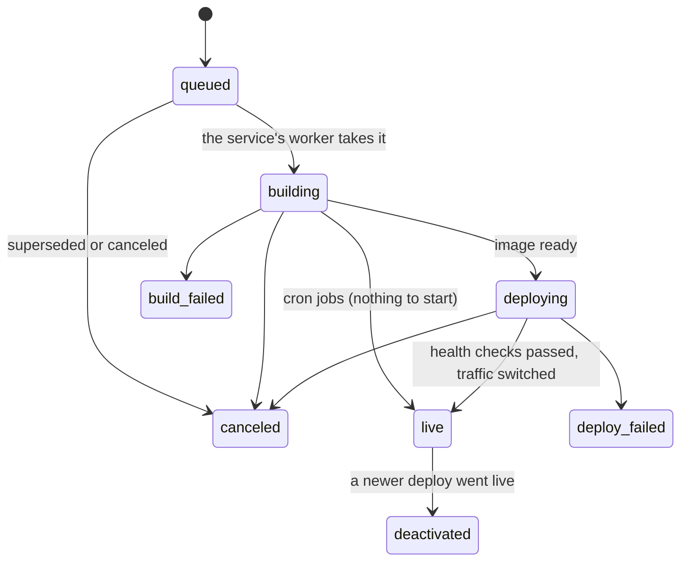
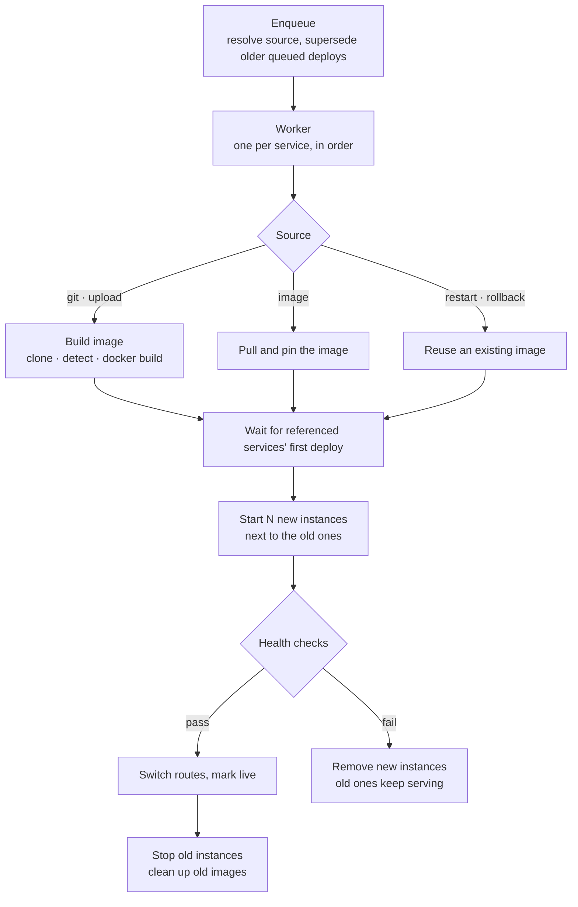

A deploy turns a source (a git commit, an uploaded folder, an image, or an earlier deploy's image) into running instances behind the proxy. The engine runs it in the background: the API call that starts it only queues it and returns `202`. This page follows one deploy through `ferry-engine`; [Deploys](/docs/concepts/deploys) covers the same ground from the user's side.

## States



Every deploy records what started it:

| Trigger | Started by |
|---|---|
| `create` | Creating a service with a source (unless `deploy: false` / `--no-deploy`) |
| `manual` | `ferry deploy`, the dashboard, `POST /api/v1/services/{id}/deploys` |
| `upload` | `ferry up` (an uploaded `.tar.gz`) |
| `webhook` | A GitHub push to the service's branch |
| `deploy_hook` | The service's secret deploy hook URL |
| `blueprint` | A blueprint apply |
| `restart` | `ferry restart`, or a changed cron job command (runs use the live deploy's command) |
| `env_change` | A variable change saved with a restart |
| `rollback` | `ferry rollback` |

## The steps



<Steps>
<Step>

### Enqueue

`Engine::deploy` resolves the source. An explicit one wins (a commit, a rollback target); otherwise it comes from the service: its `image`, else its `repo_url` and `branch`, else the most recent archive uploaded with `ferry up`. A service with none of these is refused (``service 'x' has no repository or image: upload code with `ferry up x` ``), and so is a suspended one (409 `service 'x' is suspended: resume it before deploying`).

The deploy is stored as `queued`, and older queued deploys of the same service are canceled with the reason `superseded by dep-…`: only the newest one matters. A restart requested while another deploy is still queued folds into that deploy instead of adding one, since it will start with the current settings anyway. A public service that has never been deployed gets an empty route right away, so its URL answers 503 ("no healthy instances yet") instead of 404 while the first deploy runs.

</Step>
<Step>

### Queue and worker

Each service has one worker that runs its deploys one at a time, in order, so two deploys of a service never overlap. Deploys of different services run in parallel, but only `--build-concurrency` builds (default 2) run at once server-wide; a deploy releases its build slot as soon as its image is ready.

</Step>
<Step>

### Build (`building`)

A git, upload or image deploy first checks the free space on the data directory's filesystem, and on Docker's root directory when it is on the same machine. Below `--min-free-disk` (default 1 GiB) the deploy fails right away as `build_failed`, with `not enough free disk space on <path>: … free, Ferry needs at least 1 GiB` and how to free some. Restarts and rollbacks aren't checked: they need no space.

- **Git and uploads:** `ferry-build` fetches the commit (or extracts the archive), detects the runtime, writes a Dockerfile for native runtimes and runs `docker build` with BuildKit, streaming every line into the deploy log. The commit and its message are recorded on the deploy as soon as they are checked out, so failed builds show them too. The service's environment reaches the build as BuildKit secrets, never as build arguments of generated Dockerfiles (see [Security model](/docs/architecture/security#secrets)). See [Builds and runtimes](/docs/concepts/builds).
- **Images:** an untagged or `latest` image is pulled on every deploy (the tag may have moved); other tags and digests only when missing. If a pull fails but a local copy exists, the local copy is used. The pulled image is then tagged `<prefix>/<service>:<deploy id>`, so restarts, rollbacks and crash replacements of this deploy run exactly this image even after the tag moves.
- **Restarts and rollbacks** reuse an existing image, after checking that it still exists.

Cron jobs stop here: they have no long-running instance, so the deploy goes live with its image, command and limits (`==> Limits: 512 MiB memory, 1 CPU per run`), and the scheduler starts a container from it at each run.

Before starting anything, the deploy waits for services whose port it references (`${{service.NAME.port}}`, `hostport`, `internalUrl`) and that are still on their first deploy. See [Env var references](/docs/reference/env-references#port-references-wait-for-the-first-deploy).

</Step>
<Step>

### Start (`deploying`)

The deploy takes the service's lock, so the reconciler and other operations leave its containers alone until it ends. Then it fixes everything its instances will run with:

- **Environment:** the service's own variables and those of its env groups, merged, with every [reference](/docs/reference/env-references) resolved, plus the variables Ferry injects (`PORT`, `FERRY_*`).
- **Port** (services that listen): the service's `port` setting, else a `PORT` variable, else the build's hint (80 for static sites), else the image's single exposed port, else `--default-port` (10000). The log says which: `==> Using port 80 (service setting)`.
- **Command, disk and image.**
- **Resource limits:** the service's memory and CPU limits, if it sets them. If not, the spec has none, and each container gets the server's defaults (`--default-memory-limit`, `--default-cpu-limit`) when it is created.

This launch spec is saved with the deploy. It then starts the desired number of instances, each on the private network with its service name as DNS alias, restart policy `unless-stopped`, and its port published on `127.0.0.1:<random port>` ([why](/docs/architecture/networking-model#why-127001-published-ports)). Each also gets its memory limit (with no swap beyond it), its CPU limit, the `--pids-limit` and, when the Docker daemon's default log driver is `json-file`, log rotation (`--log-max-size`, `--log-max-files`). The log says which limits: `==> Limits: 512 MiB memory, 1 CPU per instance`. A CPU limit above the Docker host's CPU count is capped at it, with a warning in the deploy log; on a host whose kernel has no CPU CFS quotas, no CPU limit is set, with a warning too.

- **Blue/green (the default):** the old instances keep serving while the new ones start.
- **Recreate (services with a disk):** a disk can't be shared safely, so the old instance is stopped first and the service is briefly unavailable.

</Step>
<Step>

### Health check

Each new instance is checked every second until it passes or `--health-check-timeout` (default 120 seconds) runs out:

| Service | Check |
|---|---|
| With a health check path | `GET http://127.0.0.1:<host port><path>` with the service's default host as `Host` answers with a status below 400 |
| Listening, no path | The port accepts a TCP connection (and doesn't close it at once) |
| Background worker | The process is still running 5 seconds after it started |

An instance that exits fails the deploy immediately, and its last 50 log lines are copied into the deploy log. An instance the kernel killed for going over its memory limit fails it with `instance ab12cd ran out of memory (limit 512 MiB) — raise the service's memory limit`, even when Docker already restarted it (the container's Docker events tell). While waiting, the new instances' output streams into the deploy log. When nothing answers on the port, the failure message suggests the usual cause: the app must listen on `$PORT` on `0.0.0.0`, not on `127.0.0.1` inside its container.

</Step>
<Step>

### Swap and go live

Passing the health checks is the point of no return. For web services and static sites, the proxy's routes for every hostname of the service switch to the new instances in one step. The deploy is marked `live` right away and the previous live deploy becomes `deactivated`, so if the server stops while the old instances drain, it comes back with the new deploy.

Then the old instances are stopped (10-second grace period, then killed) and removed. For web services and static sites, a 2-second pause comes first, so requests already in flight on the old instances can finish. The log ends with `==> Your service is live 🎉` and the service's URLs.

</Step>
<Step>

### Clean up

After every deploy, the service's own images beyond the newest `--keep-images` (default 5) are deleted: never the live deploy's image nor those of active deploys, and never pulled public images, only tags this server built or pinned. Old uploaded archives and build scratch directories are deleted too. Rollbacks can only target deploys whose image is still there.

</Step>
</Steps>

## A deploy log

System lines start with `==> `; the other lines are the build's or the containers' own output. An image deploy of a web service with two instances:

```text title="ferry logs --deploy dep-3271cdfd1415400d9a5e" noCopy
09:38:58 ==> Starting deploy dep-3271cdfd1415400d9a5e (trigger: blueprint)
09:38:58 ==> Using image nginx:alpine (already present)
09:38:58 ==> Pinned nginx:alpine as docsc3/hello:dep-3271cdfd1415400d9a5e
09:38:58 ==> Using port 80 (service setting)
09:38:58 ==> Limits: 512 MiB memory, 1 CPU per instance
09:38:58 ==> Starting 2 instance(s)
09:38:58 ==> Started instance 9c5087 (port 80, published on 127.0.0.1:63120)
09:38:58 ==> Started instance 77122e (port 80, published on 127.0.0.1:63121)
09:38:58 ==> Waiting for 2 instance(s) to become healthy: GET / must answer with a status below 400 (timeout 120s)
09:38:59 ==> Health check passed
09:38:59 ==> Routing traffic to the new instance(s)
09:38:59 ==> Your service is live 🎉
09:38:59 ==> Available at http://hello.localhost:18091
```

## When a deploy fails

A failed deploy never touches what is live. Its new instances are removed, the old ones keep serving, and the deploy ends as `build_failed` (anything up to the image) or `deploy_failed` (starting, health checks) with a one-line `error`, also written to the log as `==> Build failed: …` or `==> Deploy failed: …`. Fix the cause and deploy again, or [roll back](/docs/reference/cli#ferry-rollback) to an earlier deploy.

## Canceling

`ferry cancel DEPLOY_ID` (or `POST /api/v1/deploys/{id}/cancel`) depends on how far the deploy got:

| State | Effect |
|---|---|
| `queued` | Canceled at once. |
| `building` | The build is stopped (`docker build` is killed). |
| `deploying`, before the swap | The new instances are removed; the old ones keep serving. |
| After the swap | Refused with 409: `too late to cancel: traffic was already switched to deploy dep-… (roll back to undo it)`. |
| Finished | Refused with 409: `deploy dep-… is already canceled` (or whichever final status it has). |

Suspending or deleting a service cancels its queued and running deploys the same way.

## Restarts and rollbacks

Both are deploys that reuse an image instead of building one:

- **Restart** runs the live deploy's image with the **current** settings, resource limits and environment. It resolves which deploy is live when it runs, not when it was queued, so a restart queued behind another deploy doesn't undo it. This is how variable changes reach running containers.
- **Rollback** runs the image of an earlier deploy. Only deploys that were live (`live` or `deactivated`) can be targets, and their image must still exist (see `--keep-images`). The settings, resource limits and environment are the current ones, like a restart.

## Settings take effect through deploys

Instances only ever start from a live deploy's saved launch spec: the reconciler replacing a crashed instance, scaling up, resuming, and every cron run or one-off job all reuse it. A change to settings, resource limits or variables therefore takes effect only through a new deploy or a restart, as on Render, and a deploy that failed because of a bad change can't break self-healing of the version that is live.

The server's default limits are the one exception: a spec without limits of its own gets the defaults `ferryd` runs with when each container is created, so after a change of `--default-memory-limit` or `--default-cpu-limit`, such a service's replaced instances and job runs get the new defaults.

## Server restarts and shutdown

On shutdown (first `SIGINT` or `SIGTERM`), queued deploys fail with `interrupted by server shutdown` and running ones are stopped the same way. On the next start, before anything else, deploys a previous process left unfinished are failed with `interrupted by server restart` (`build_failed`, or `deploy_failed` if they were starting instances), and their containers are removed. Deploys that went live stay live: the [reconciler](/docs/architecture/reconciler) brings their instances back.
