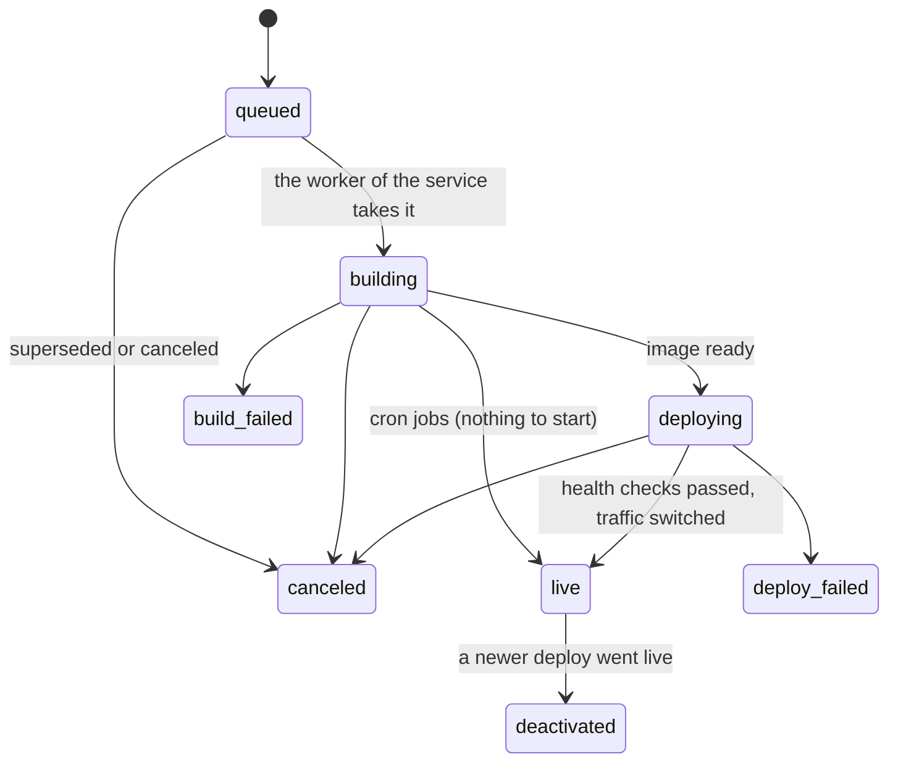

A <Term id="cron-job" /> has no instance to start. Its deploy goes from `building` to `live`.

For the user view of each state, see [Deploy statuses](/docs/concepts/deploys/statuses).

## The trigger

Each deploy records its <Term id="trigger" />.

| Trigger | Cause |
|---|---|
| `create` | You create a service with a source, without `deploy: false` or `--no-deploy` |
| `manual` | `ferry deploy`, the dashboard, or `POST /api/v1/services/{id}/deploys` |
| `upload` | `ferry up` (an uploaded `.tar.gz`) |
| `webhook` | A GitHub push to the branch of the service |
| `deploy_hook` | The secret deploy hook URL of the service |
| `blueprint` | A blueprint apply |
| `restart` | `ferry restart`, or a new command of a cron job |
| `env_change` | A change of variables that you save with a restart |
| `rollback` | `ferry rollback` |

The runs of a cron job use the command of the live deploy. Thus a new command starts a deploy with the trigger `restart`. See [What starts a deploy](/docs/concepts/deploys/triggers).
