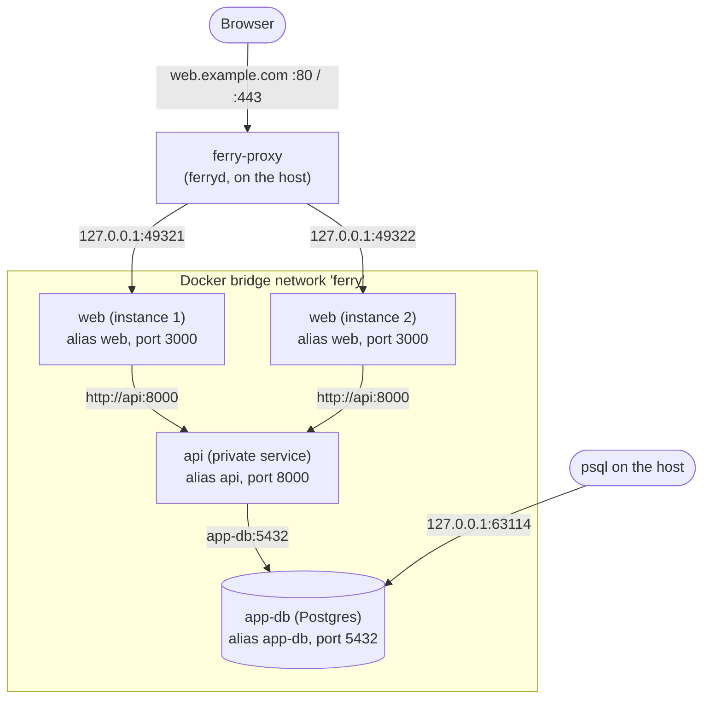
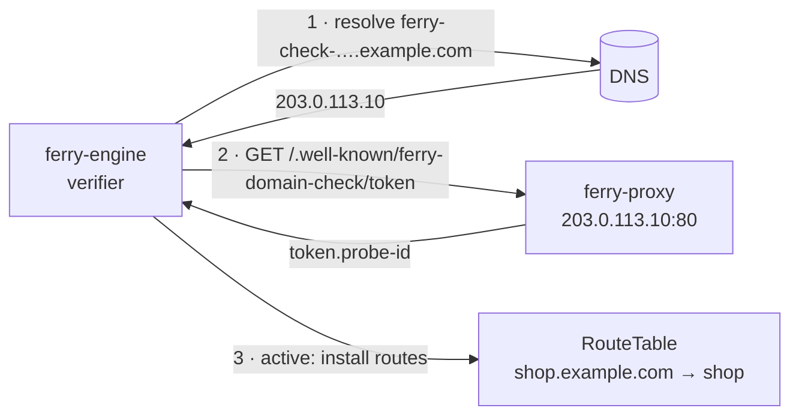

Ferry uses two kinds of connections: containers talk to each other on a private Docker network, and the outside world reaches public services only through the proxy built into `ferryd`. Both ends of the proxy stay on the host: it listens on the public addresses you choose and connects to containers through ports published on `127.0.0.1`.



## The private network

Each server creates one user-defined bridge network named after its prefix (`--name-prefix`, default `ferry`). Every service container and every datastore joins it with a DNS alias equal to its name, so containers reach each other by name:

- A service at `http://NAME:PORT`, for example `http://api:8000`. All instances of a service share the alias, and Docker's DNS answers with the addresses of all of them.
- A datastore at `NAME:5432` (Postgres) or `NAME:6379` (Redis), or through its full connection string.

Use [env var references](/docs/reference/env-references) such as `${{service.api.internalUrl}}` or `${{datastore.app-db.connectionString}}` instead of writing these addresses by hand. Job runs (cron and one-off) join the same network, so they reach private services and datastores too. See [Networking and domains](/docs/concepts/networking) for the user-level view.

## Published ports

Every container that listens (web services, private services and static sites) publishes its container port on `127.0.0.1` with a **random host port** chosen by Docker. The deploy log shows it: `==> Started instance 9c5087 (port 80, published on 127.0.0.1:63120)`. The proxy and the health checks connect to that address, never to the container's IP. Background workers, cron jobs and job runs publish nothing.

### Why 127.0.0.1 published ports

- **It works on Docker Desktop.** On macOS and Windows, containers run inside a VM and their IPs are unreachable from the host, where `ferryd` runs. Published ports work everywhere, on Docker Desktop and on Linux alike.
- **Nothing is exposed by accident.** Binding to `127.0.0.1` means an app is never reachable on the machine's public interfaces directly: the proxy is the only way in, with its routing, TLS and limits. Private services get a published port too, for health checks, but it is only reachable from the host itself.
- **No port conflicts.** Random host ports let the old and the new instances of a blue/green deploy, and any number of instances, listen on the same container port side by side.

The trade-off is that a host port can change: when Docker restarts a crashed container, it may publish it on a new port. The engine follows this with a [route watcher](/docs/architecture/reconciler#when-it-runs) that checks running instances every second and a full reconcile every 10 seconds, so routes always point at the current ports.

### The port your app listens on

For each deploy, Ferry picks the container port in this order, and injects it as `PORT`:

1. the service's `port` setting (`--port`),
2. a `PORT` variable you set,
3. the build's hint (80 for static sites served by nginx),
4. the image's `EXPOSE`d port, if it exposes exactly one,
5. the server's `--default-port` (10000).

Your app must listen on that port on **`0.0.0.0`**. An app that listens on `127.0.0.1` inside its container can't be reached from outside the container, and its deploy fails the health check with a hint saying so.

## Datastore ports

A datastore publishes its port on `127.0.0.1` too, but on a **fixed** host port allocated once when it is created and kept across restarts (a new one is allocated only if that port was taken meanwhile). `ferry db ls` shows it:

```text title="ferry db ls" noCopy
NAME     KIND       VERSION   STATUS      INTERNAL      HOST PORT   CREATED
app-db   postgres   16        available   app-db:5432   63114       10s ago
cache    redis      7         available   cache:6379    63115       10s ago
```

The external connection string uses that port with the host from `--advertise-host` (default `127.0.0.1`). That flag only changes the printed host: the port stays bound to `127.0.0.1`, so to reach a datastore from another machine, use an SSH tunnel (`ssh -L 63114:127.0.0.1:63114 your-server`).

## Hostnames and routing

The proxy (`--proxy-addr`, default `0.0.0.0:8080`, and `--https-addr` for TLS) routes each request by its `Host` header, ignoring the port:

| Hostname | Routed to |
|---|---|
| `<name>.<domain>`, for each served domain of the server | The web service or static site `<name>`. The base domain (`--base-domain`) is always served; a [connected domain](#domains) is served once its DNS reaches the server. With the default base domain `localhost`, browsers resolve `*.localhost` to `127.0.0.1` without any DNS setup. |
| A custom domain | The service that claimed it. Domains are unique across services, and can't be a hostname under a domain of the server. |
| `ferry.<base-domain>` (the dashboard host) | The API and dashboard (`--api-addr`). On by default only for local base domains; see [Security model](/docs/architecture/security#exposure). |

Requests are spread round-robin over the service's routable instances. HTTP/1.1 and HTTP/2 clients are supported, websockets are passed through, and a bodyless `GET` or `HEAD` whose connection fails is retried once on another instance. Requests reach the app as HTTP/1.1 with the original `Host` and the forwarding headers described in [Security model](/docs/architecture/security#proxy-headers).

When the proxy answers by itself, the response carries an `x-ferry-error` header:

| Status | `x-ferry-error` | When |
|---|---|---|
| 400 | `bad_request` | Missing or malformed `Host`. |
| 404 | `not_found` | No service has this hostname. |
| 405 | `method_not_allowed` | `CONNECT`, which a reverse proxy doesn't forward. |
| 408 | `request_timeout` | The client stopped sending its request body. |
| 503 | `suspended` | The service is suspended. |
| 503 | `no_upstreams` | No instance accepts connections yet (never deployed, deploy in progress, or crashed). Sent with `Retry-After: 5`. |
| 502 | `bad_gateway` | The instance refused the connection or failed mid-request. |

## Domains

The domains of the server live in the database, and the set that is served lives in the configuration every part of `ferryd` derives hostnames from. Connecting, verifying, promoting or disconnecting a domain replaces that set, and the engine installs the routes of every service again under its new hostnames. The upstreams don't change: no container is touched, and no deploy is needed.

A connected domain is only served once it is **verified**. The engine resolves a made-up name under it, `ferry-check-<random>.<domain>`, then requests `/.well-known/ferry-domain-check/<token>` for that name from the address it resolved to, on the public HTTP port. The proxy answers that path for any host with the token followed by an id made up when the process started, so the engine knows the request came back to this very process and not to another server.



A new name each time means only a wildcard record answers for it, and no resolver has an old answer in its cache. A pending domain is verified every 15 seconds, an active one every 10 minutes; three failures in a row flag an active domain as misconfigured, and it stays served. [Connect a domain](/docs/guides/domains) describes it from the user's side.

## HTTPS

With `--https-addr` and `--acme-email`, the proxy also terminates TLS. `ferry-tls` requests a Let's Encrypt certificate (ACME HTTP-01, answered by the proxy on plain HTTP at `/.well-known/acme-challenge/`) for every public hostname within seconds of it being routed (the route table wakes the certificate loop when its hostnames change), keeps certificates in `<data-dir>/certs`, and renews them when they expire within 30 days. Plain-HTTP requests to a host that has a certificate are redirected to HTTPS with a `308`. Local hostnames (`*.localhost`, `.local`, `.internal`, `.test`, IP addresses) never get a certificate and stay on HTTP. The [custom domains and HTTPS guide](/docs/guides/custom-domains-https) has the full setup.
