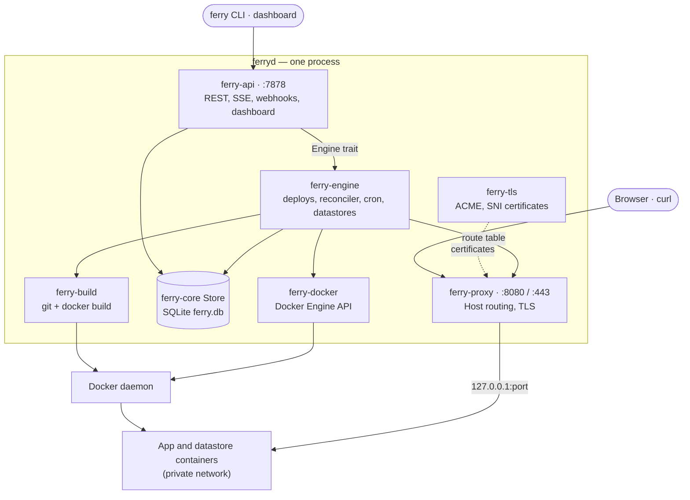
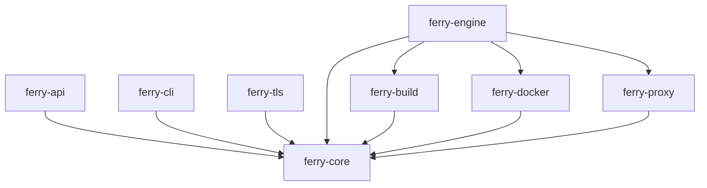
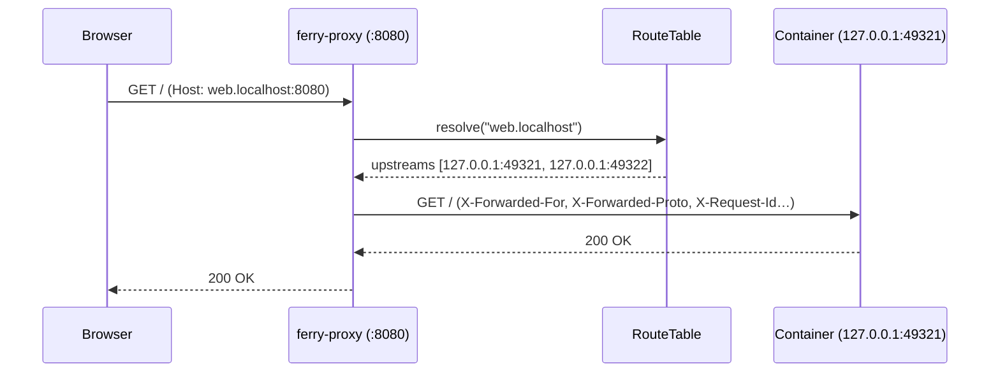
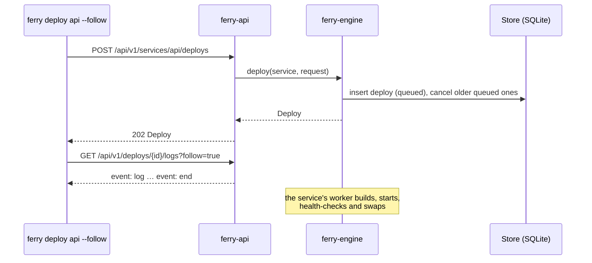

import { Network, RefreshCw, ShieldCheck, Workflow } from 'lucide-react';

Ferry is one server process, `ferryd`, plus a command-line client, `ferry`. Both are built from a Cargo workspace of nine crates. `ferryd` keeps the desired state in SQLite, drives Docker through its Engine API, builds images with the `docker` and `git` command-line tools, and serves both the public reverse proxy and the admin API.

## Crates

- **`ferry-core`** (library). The shared vocabulary: domain models, API request and response types, configuration, the SQLite `Store`, env var merging and [reference resolution](/docs/reference/env-references), validation, resource limit ranges and parsing, cron schedules, Docker naming, and the `Engine` and `TlsHooks` traits that decouple the other crates.
- **`ferry-docker`** (library). A typed wrapper over the Docker Engine API (through `bollard`): containers, images, volumes, networks, logs, stats and exec. It knows nothing about services or deploys.
- **`ferry-build`** (library). Turns source into an image: git fetch or archive extraction, runtime detection, Dockerfile generation for native runtimes, and `docker build` with BuildKit, streamed into the deploy log.
- **`ferry-proxy`** (library). The public edge: the `RouteTable`, the HTTP/1.1 and HTTP/2 reverse proxy with round-robin load balancing, websockets, error pages, TLS termination and connection limits.
- **`ferry-tls`** (library). Automatic HTTPS: ACME HTTP-01 certificates (Let's Encrypt by default), storage and renewal, SNI resolution for the proxy.
- **`ferry-engine`** (library). The brain: the deploy queue and pipeline, the reconciler, the cron scheduler and one-off jobs, datastores, container resource limits and the free-disk check, and log storage. It implements `ferry_core::Engine`.
- **`ferry-api`** (library). The axum router: REST, Server-Sent Events, webhooks, blueprints, the OpenAPI document and Swagger UI, and the embedded web client from `web/dist`.
- **`ferry-cli`** (binary `ferry`). The command-line client. It talks only to the REST API.
- **`ferryd`** (binary). The wiring: parses the [server options](/docs/reference/server-options), locks the data directory, claims the Docker name prefix, then starts the engine, the proxy and the API.

Dependencies point one way, so each crate can be built and tested on its own. `ferry-core` depends on no other Ferry crate, and `ferryd` depends on all of them:

`ferry-api` never depends on `ferry-engine`: it holds an `Arc<dyn Engine>` and calls the trait from `ferry-core`, which is also how its tests replace the engine with a recording mock. In the same way, the proxy asks `ferry-tls` for ACME challenge answers (and whether a host has a certificate) through the `TlsHooks` trait, and terminates TLS with the certificate resolver `ferryd` hands it. Only `ferryd` knows every crate.

## How a request flows

### A request to an app

The proxy routes by `Host` header. It never calls the engine or the database on the request path: it reads the in-memory route table, which the engine updates after each deploy and on every reconcile pass.

An unknown host gets a 404 page, a suspended service a 503 page, and a service with no healthy instance a 503 with `Retry-After`. The [networking model](/docs/architecture/networking-model) explains why upstreams are always `127.0.0.1` ports.

### An API call

Every `/api/v1` request goes through the token check, then a handler that validates the input, writes to the store and, for anything that touches containers, calls the engine. Long work is queued: the handler returns `202` with the queued deploy, and the client follows its log as a stream.

After every write, the API nudges the [change feed](/docs/reference/api-overview#change-feed) so the dashboard refreshes at once.

## What runs in the background

| Task | When | Does |
|---|---|---|
| Deploy workers | One per service with queued deploys | Run that service's deploys one at a time, in order. A server-wide limit (`--build-concurrency`, default 2) bounds concurrent builds. See [Deploy pipeline](/docs/architecture/deploy-pipeline). |
| Reconciler | At boot, every 10 seconds, and after scale, suspend and resume | Converges containers and routes to the store. See [Reconciler](/docs/architecture/reconciler). |
| Route watcher | Every second | Follows the host ports of running instances, so routes follow a container Docker restarted on a new port. |
| OOM watcher | On each Docker `oom` event | Logs every container of this server that the kernel killed for going over its memory limit. See [Reconciler](/docs/architecture/reconciler#when-it-runs). |
| Cron scheduler | About every 15 seconds | Starts the runs of cron jobs whose schedule fired (UTC). Runs missed while the server was down are skipped. |
| Change-feed detector | Every second, only while a client listens | Compares the store and broadcasts what changed. |
| TLS manager | With `--https-addr` and `--acme-email` | Requests certificates for public hosts and renews those that expire within 30 days. |

## State

Everything `ferryd` knows lives in its data directory (`--data-dir`, default `./ferry-data`):

<Files>
  <Folder name="ferry-data" defaultOpen>
    <File name="ferry.db — SQLite: services, deploys, job runs, datastores, env groups, env vars, settings" />
    <File name="api_token — the API token (0600)" />
    <File name="instance_id — owner id of the Docker name prefix (0600)" />
    <File name="ferryd.lock — held while ferryd runs" />
    <Folder name="logs">
      <File name="deploys/<deploy id>.log — one JSON log line per line" />
      <File name="jobs/<job id>.log" />
    </Folder>
    <File name="builds/ — scratch build contexts, deleted after each build" />
    <File name="repos/ — git mirrors, one per service" />
    <File name="uploads/ — source archives uploaded by ferry up" />
    <File name="certs/ — ACME account, certificates and keys" />
  </Folder>
</Files>

Container state lives in Docker, not in the data directory: images, containers, the private network, datastore volumes and disks. Ferry finds its own resources by name prefix and labels:

| Resource | Name |
|---|---|
| Network | `<prefix>` (default `ferry`) |
| Image | `<prefix>/<service>:<deploy id>` |
| Service container | `<prefix>-<service>-<deploy short id>-<random>` |
| Job container | `<prefix>-job-<service>-<job short id>` |
| Datastore container and volume | `<prefix>-ds-<name>` and `<prefix>-ds-<name>-data` |
| Service disk | `<prefix>-svc-<service id>-disk` |
| Ownership marker volume | `<prefix>-owner` |

Every container carries `ferry.managed=true`, `ferry.instance=<prefix>` and `ferry.role` (`service`, `job` or `datastore`), plus `ferry.service`, `ferry.deploy`, `ferry.job` or `ferry.datastore` as relevant. The engine only ever lists and touches containers whose `ferry.instance` is its own prefix, which is what lets several servers share one Docker daemon ([Security model](/docs/architecture/security#one-server-per-data-directory-and-prefix)).

## Read next

<Cards>
  <Card icon={<Workflow />} title="Deploy pipeline" href="/docs/architecture/deploy-pipeline" description="Every step from enqueue to live, and how failures and cancels are handled." />
  <Card icon={<RefreshCw />} title="Reconciler" href="/docs/architecture/reconciler" description="The loop that converges Docker to the desired state." />
  <Card icon={<Network />} title="Networking model" href="/docs/architecture/networking-model" description="The Docker network, DNS aliases, published ports and the proxy route table." />
  <Card icon={<ShieldCheck />} title="Security model" href="/docs/architecture/security" description="API token, secrets, data directory permissions and what the proxy exposes." />
</Cards>
