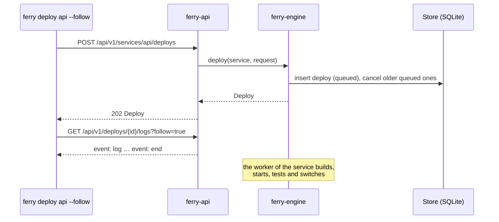

Each `/api/v1` request goes through three steps:

1. **The authentication check.** It accepts an <Term id="api-token" /> or the session cookie of the dashboard. See the [security model](/docs/architecture/security).
2. **A handler.** It validates the input and writes to the <Term id="store" />.
3. **The engine.** For all work on containers, the handler calls the <Term id="engine" />.

## Long work goes in a queue

The handler does not wait for a <Term id="deploy" />. It answers `202` with the deploy in the queue. The client then follows the log of the deploy as a stream.

After each write, the API signals the <Term id="change-feed" />. See [the API overview](/docs/reference/api-overview/change-feed). Thus the dashboard updates immediately.

## The crates

| Crate | Contents |
|---|---|
| `ferry-api` | The axum router: REST, authentication (the account, its sessions and API tokens), <Term id="sse" />, webhooks and blueprints. Also the OpenAPI document, Swagger UI and the web client from `web/dist`. |
| `ferry-cli` | The program `ferry`: the command-line client. It talks only to the REST API. |
| `ferry-scm` | The git providers (GitHub, GitLab): authorization in the browser, tokens and the list of repositories. |

<Accordions>
  <Accordion title="The API does not know the engine crate">
    `ferry-api` never depends on `ferry-engine`. It holds an `Arc<dyn Engine>` and calls the <Term id="trait" /> from `ferry-core`. See [The crates](/docs/architecture/overview/crates).
  </Accordion>
</Accordions>
