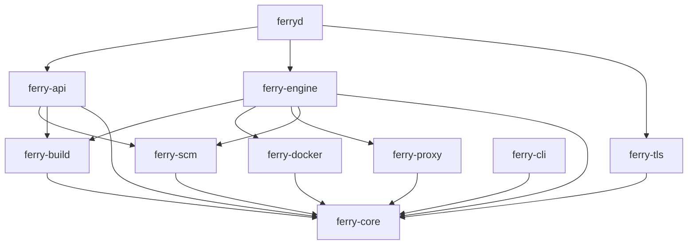

A <Term id="crate" /> is a package of Rust code. The dependencies go one way. Thus you can build and test each crate alone.

| Crate | Kind | Role |
|---|---|---|
| `ferry-core` | Library | The shared types and [the store](/docs/architecture/overview/store). It depends on no other Ferry crate. |
| `ferry-docker` | Library | [Controls containers](/docs/architecture/overview/docker) through the Docker Engine API. |
| `ferry-build` | Library | [Changes source into an image](/docs/architecture/overview/docker). |
| `ferry-scm` | Library | The git providers: GitHub and GitLab. |
| `ferry-proxy` | Library | [The public edge](/docs/architecture/overview/proxy): routes, load balancing, TLS. |
| `ferry-tls` | Library | Automatic HTTPS certificates. |
| `ferry-engine` | Library | [The engine](/docs/architecture/overview/engine): deploys, reconciler, cron, datastores. |
| `ferry-api` | Library | [The REST API](/docs/architecture/overview/api) and the dashboard. |
| `ferry-cli` | Program `ferry` | The command-line client. |
| `ferryd` | Program | [The server](/docs/architecture/overview/startup). It connects the other crates. |

## Traits keep the crates apart

`ferry-api` never depends on `ferry-engine`. It holds an `Arc<dyn Engine>` and calls the <Term id="trait" /> from `ferry-core`. In the tests of the API, a mock that records the calls replaces the engine.

The proxy calls `ferry-tls` through the `TlsHooks` trait in the same way. Only `ferryd` knows the engine, the proxy, the API and `ferry-tls` together.
