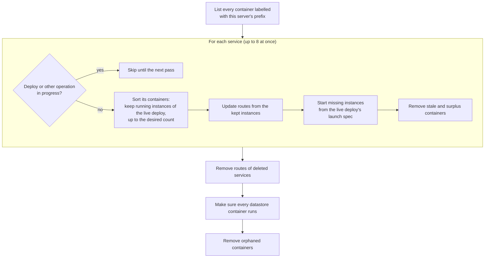

The store says what should run: which deploy is live for each service, how many instances it wants, whether it is suspended, which datastores exist. Docker says what does run. The reconciler, in `ferry-engine`, compares the two and fixes the difference. It is what restarts a crashed service, applies a new instance count, and cleans up after a server that stopped halfway through something. See [Self-healing](/docs/concepts/self-healing) for what this means for your apps.

## When it runs

| Pass | When | Notes |
|---|---|---|
| Boot | At startup, before the proxy accepts traffic | Routes are installed first, synchronously, so the proxy serves the live instances from its first request; the rest of each service's convergence continues in the background. |
| Periodic | Every 10 seconds (the first one 2 seconds after boot) | A full pass over every service and datastore. |
| On demand | After every deploy; on scale and resume | A full pass right after a deploy ends (to converge anything that changed meanwhile, such as a scale during the deploy). Scale and resume converge their one service at once. |

Next to the passes, a **route watcher** lists the running instances every second. When Docker restarts a crashed container on a new host port, the watcher refreshes that service's routes as soon as the new instance accepts connections, without waiting for the next pass.

Passes never overlap, and each one runs in its own task: a failure is logged and the next pass starts on time.

## One pass

### Services

For each service, the reconciler first takes the service's lock without waiting. A service that is busy (a deploy starting instances, a scale, a suspend) is skipped until the next pass, so the reconciler never fights a deploy.

Then it sorts the service's containers:

- **Kept:** running (or restarting) containers of the live deploy, up to the desired instance count, running ones first.
- **Removed:** exited, dead or never-started containers, containers of any other deploy, and instances beyond the desired count.

Routes are updated before anything is removed, so traffic never goes to an instance that is about to stop. Missing instances are then started, always from the **live deploy's launch spec**: the image, resolved environment, command, port and disk saved when that deploy went live, never the current settings (see [Deploy pipeline](/docs/architecture/deploy-pipeline#settings-take-effect-through-deploys)). If that image no longer exists, the reconciler logs a warning and starts nothing: deploy again.

Stale containers from deploys that never went live (failed, canceled, interrupted) are removed at once. The others, such as a previous deploy's leftovers or surplus instances after scaling down, get a 10-second stop grace period.

For a service with a disk, the order flips: at most one instance, and the stale one goes before a new one starts, because two containers can't share the volume safely.

### Routes

The route table in the proxy is rebuilt from what really runs:

| Service state | Route |
|---|---|
| Running instances that accept TCP connections | Round-robin over their `127.0.0.1:<host port>` addresses |
| No instance accepts connections yet | 503 page with `Retry-After` |
| Suspended | 503 "suspended" page |
| Deleted | Routes removed (404 for its hostnames) |
| Private services, workers, cron jobs | No route: they aren't public |

The dashboard's own route (`ferry.<base-domain>`, when enabled) is installed by `ferryd` and never removed.

### Datastores

Every datastore marked `available` must have a running container. A missing, stopped, paused or dead one is provisioned again with the same volume, so its data survives. A datastore whose provisioning `failed` is retried with a backoff that starts at 60 seconds and doubles up to 30 minutes.

### Orphans

A container with this server's prefix whose service or datastore no longer exists in the store is removed, and so is the container of a job run that has finished or is unknown. The container list is taken before the store is read, so a resource created during the pass is never mistaken for an orphan. Containers with an unknown `ferry.role` are left alone.

## At boot

Before the first pass, the engine settles what a previous process left unfinished:

- Deploys still `queued` or `building` fail as `build_failed`, and deploys still `deploying` as `deploy_failed`, with the error `interrupted by server restart`. Their containers never served, so the first pass removes them at once.
- Job runs still pending or running fail with the same error.
- Leftover build scratch directories are deleted.

Then the boot pass installs the routes of every live deploy and brings back the instances that are missing, for example after a reboot of the machine.

## What it never does

- It never changes settings, variables or instance counts: it only makes Docker match them.
- It never starts instances from anything but a live deploy's launch spec.
- It never deletes volumes. Datastore volumes and service disks are only removed when you delete the datastore or the service.
- It never touches containers of another prefix: see [one server per data directory and prefix](/docs/architecture/security#one-server-per-data-directory-and-prefix).
