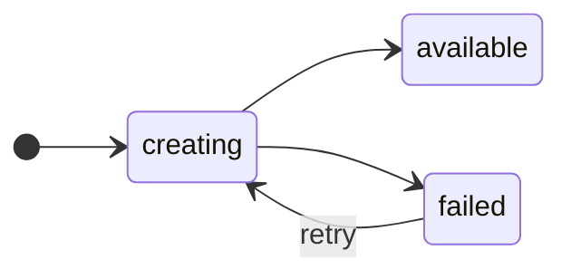

A <Term id="datastore" /> goes from `creating` to `available`, or to `failed` with an `error`.

## The test

| Kind | The datastore is available when |
|---|---|
| Postgres | `pg_isready` succeeds in the container, over TCP, for the user and the database. |
| Redis | `redis-cli ping` answers `PONG`. |

Ferry waits 60 seconds for a good answer. If the timeout of the <Term id="health-check" /> (`--health-check-timeout`) is longer, Ferry waits that long.

## See the status

```bash title="Terminal"
ferry db show app-db
```

```text title="Output (one line)" noCopy
Status:         available
```

<Accordions>
  <Accordion title="If the status is failed">
    The `error` gives the cause. Ferry tries again by itself. See [If a datastore stops](/docs/concepts/datastores/repair).
  </Accordion>
  <Accordion title="The password in the Redis test">
    Ferry gives the password to `redis-cli` in the environment of the command. The password is never on a command line.
  </Accordion>
</Accordions>
