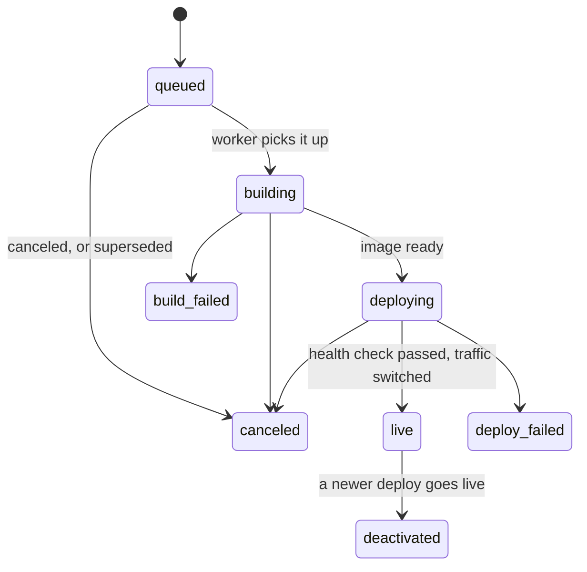
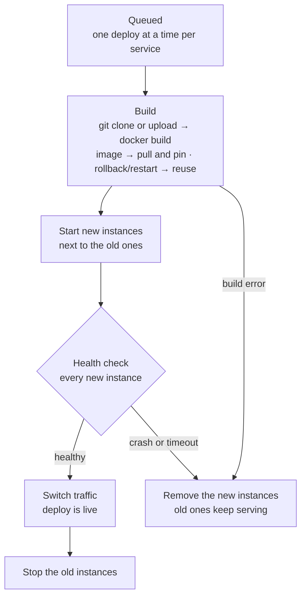

import { Hammer, HeartPulse, Scaling, ScrollText } from 'lucide-react';

A **deploy** ships one version of a service. It builds (or pulls) an image, starts new containers next to the old ones, checks that they are healthy, switches traffic to them, then stops the old ones. If anything goes wrong before the switch, the old version keeps serving as if nothing happened.

Every deploy is kept in the service's history with its status, trigger, source, image, commit and log. `ferry deploys` lists the 20 newest (`-n` for more), followed by the reason of each failed one:

```bash title="Terminal"
ferry deploys node-hello
```

```text title="Output" noCopy
ID                         STATUS          TRIGGER      COMMIT   CREATED   DURATION
dep-fad68a5ea71b43ae9820   live            upload       -        7m ago    2s
dep-7d2d938ff3614c238ecb   canceled        manual       -        10m ago   0s
dep-d21d077ff8464b4a9501   deactivated     manual       -        11m ago   2s
dep-73cf1b7d77a8489b92c4   deactivated     manual       -        12m ago   2s
dep-7306e1c741694445a2bc   deactivated     env_change   -        16m ago   1s
dep-ca4bc7b5862742959b70   deploy_failed   upload       -        17m ago   1s
dep-817fc76633764f7181c0   deactivated     manual       -        17m ago   2s
dep-aab5997404ed495db2bd   deactivated     restart      -        17m ago   1s
dep-d2f7bb0e77564c048d33   deactivated     env_change   -        17m ago   1s
dep-16d99450e6984bb18843   deactivated     rollback     -        18m ago   1s
dep-ba5a7fce730d4061aaa7   deactivated     upload       -        18m ago   1s
dep-3493c505ea9b4415b359   deactivated     upload       -        18m ago   2s
✗ dep-ca4bc7b5862742959b70: instance d1c6b8 crashed (exit code 1)
```

## Triggers

A deploy records what started it:

| Trigger | Started by |
|---|---|
| `create` | Creating a service that has a repository or an image (`ferry create`, the dashboard, `POST /api/v1/services`), unless you pass `--no-deploy` |
| `manual` | [`ferry deploy`](/docs/reference/cli#ferry-deploy), **Manual deploy** in the dashboard, [`POST /api/v1/services/{id}/deploys`](/docs/reference/api/deploys#deploy-a-service) |
| `upload` | `ferry up`, which uploads a local directory |
| `webhook` | A push to the tracked branch, for services with auto-deploy on (`POST /hooks/github`, see [Auto-deploy from GitHub](/docs/guides/github-auto-deploy)) |
| `deploy_hook` | A request to the service's secret deploy hook URL |
| `blueprint` | `ferry blueprint apply` created the service or changed its build or deploy settings (a change of variables only restarts it) |
| `rollback` | [`ferry rollback`](/docs/reference/cli#ferry-rollback), **Roll back to this deploy** |
| `restart` | `ferry restart`, **Restart service**, a blueprint that only changed variables, a new command for a cron job |
| `env_change` | Saving variables with a restart: `ferry env set` and `ferry env unset` (unless `--no-restart`), **Save & restart**, changes to a linked env group made with a restart |

What a manual deploy builds depends on the service's [source](/docs/concepts/services#sources): the tip of the branch (or `--commit <sha>`), the image pulled again, or the most recent upload. Add `--clear-cache` to build without the Docker layer cache.

### Deploy hooks

Every service has a deploy hook: a secret URL that deploys it when called with `POST` (or `GET`), without an API token ([API reference](/docs/reference/api/hooks#deploy-hook)). It is handy for CI pipelines and registry webhooks.

```bash title="Terminal"
ferry deploy-hook show api
# http://127.0.0.1:7878/hooks/deploy/srv-fd3c827106384b268113?key=9e15bc88e44747ea86477949fae877f8

curl -X POST 'http://127.0.0.1:7878/hooks/deploy/srv-fd3c827106384b268113?key=9e15bc88e44747ea86477949fae877f8'
```

The hook answers `202` with a short summary of the queued deploy. Anyone with the URL can deploy the service: if it leaks, `ferry deploy-hook rotate api` replaces the key, and the old URL stops working at once. A wrong key and an unknown service id get the same `401`.

`ferry deploy-hook show` builds the URL from the server address the CLI is connected to. A CI system outside your server must call it through an address it can reach, such as the dashboard host over HTTPS (see [Production setup](/docs/guides/production)).

## Statuses



| Status | Meaning |
|---|---|
| `queued` | Waiting for the service's previous deploy, or for a build slot. |
| `building` | Cloning, extracting or pulling the source and building the image. |
| `deploying` | Starting the new instances and running their health checks. |
| `live` | Serving traffic. A service has at most one live deploy. |
| `deactivated` | Was live, then replaced by a newer deploy. You can roll back to it. |
| `build_failed` | The source couldn't be fetched or the image couldn't be built or pulled. |
| `deploy_failed` | The image was built but the new instances didn't become healthy. |
| `canceled` | Canceled by you, or replaced by a newer queued deploy. |

A failed deploy has an `error` with the reason, shown by `ferry deploys`, `--follow` and the **Why it failed** box in the dashboard; the full story is in its log.

## How a deploy runs



1. **Queue.** Each service has its own queue and deploys one version at a time, in order; different services deploy in parallel. When a new deploy is queued, older deploys of the same service that are still waiting are canceled ("superseded by dep-…"), so only the newest one runs. Builds are limited server-wide by `--build-concurrency` (2 by default); a deploy waiting for a slot says so in its log.
2. **Build.** Ferry fetches the source and builds an image named `<prefix>/<service>:<deploy-id>`, or pulls the image of an image service, or reuses an existing image for restarts and rollbacks. Before building or pulling, it checks that the server has enough [free disk space](/docs/concepts/resource-limits#free-disk-space) (`--min-free-disk`, 1 GiB by default). See [Builds & runtimes](/docs/concepts/builds). A cron job's deploy stops here: it is marked live and its schedule uses the new image.
3. **Start.** Ferry picks the container port, resolves the environment (including `${{…}}` references) and starts as many new containers as the service has instances, each with the service's [memory and CPU limits](/docs/concepts/resource-limits), while the old ones keep serving.
4. **Health check.** Every new instance must pass the [health check](#health-checks). While Ferry waits, their output is copied into the deploy log.
5. **Switch.** Web services and static sites: the proxy routes to the new instances in one step. The deploy is marked `live` right away, and the previous live deploy becomes `deactivated`.
6. **Drain.** Ferry stops the old instances, giving each 10 seconds to exit after the stop signal, and removes them. For web services and static sites, it first waits about two seconds so that requests already in flight can finish.

If the build fails, an instance crashes (or runs out of memory: `instance ab12cd ran out of memory (limit 512 MiB) — raise the service's memory limit`) or the health check times out, Ferry removes the new instances and marks the deploy `build_failed` or `deploy_failed`. The old instances were never touched: the live deploy keeps serving. The engine side of this pipeline (workers, locks, snapshots) is described in [Deploy pipeline](/docs/architecture/deploy-pipeline).

<Callout type="warning" title="Services with a disk are redeployed in place">
A service with a persistent disk runs a single instance, and two containers can't share its volume safely. Its deploys stop the old instance **before** starting the new one, so the service is briefly unavailable during each deploy. See [Disks, scaling & suspend](/docs/concepts/scaling).
</Callout>

This is what a redeploy of a web service looks like in its log:

```text title="Deploy log" noCopy
==> Starting deploy dep-ba5a7fce730d4061aaa7 (trigger: upload)
…
==> Build successful 🎉
==> Using port 10000 (default port)
==> Limits: 512 MiB memory, 1 CPU per instance
==> Starting 1 instance(s)
==> Started instance e5725a (port 10000, published on 127.0.0.1:62742)
==> Waiting for 1 instance(s) to become healthy: the port must accept TCP connections (timeout 120s)
[e5725a] node-hello listening on :10000
==> Health check passed
==> Routing traffic to the new instance(s)
==> Stopping 1 old instance(s)
==> Your service is live 🎉
==> Available at http://node-hello.localhost:8080
```

## Health checks

Ferry decides that a new instance is healthy in one of three ways:

| Service | Health check |
|---|---|
| Web service, private service or static site **with** a health check path | `GET <path>` on the instance, with the service's hostname in the `Host` header, must answer with a status below 400 |
| The same **without** a path | The instance's port must accept a TCP connection and keep it open |
| Background worker | The process must still be running 5 seconds after it started |

Ferry probes each new instance every second until every instance passes, or until the timeout: 120 seconds by default, set with `--health-check-timeout` on `ferryd`. Every 10 seconds, the log says why an instance isn't healthy yet. If an instance exits during the check, the deploy fails at once, and its last 50 lines of output are copied into the deploy log. An instance that exits *without* an error (exit code 0) is explained: the error names the command that ran, and a hint says what to change. See [The app exits right away](/docs/guides/troubleshooting#the-app-exits-right-away).

Set a path with `--health` (or **Health check path** in the settings). A dedicated endpoint that answers quickly once the app can serve is best:

```bash title="Terminal"
ferry update api --health /healthz
```

```text title="Deploy log" noCopy
==> Waiting for 2 instance(s) to become healthy: GET /healthz must answer with a status below 400 (timeout 120s)
==> Health check passed
```

The health check path only matters during deploys. Once a deploy is live, the proxy routes to the instances whose port accepts connections, and the [reconciler](/docs/concepts/self-healing) replaces instances that stop.

### Which port

Services that listen get a container port, chosen at each deploy in this order:

1. the service's **port** setting (`--port`);
2. a `PORT` variable you set in the service's environment;
3. what the build knows: 80 for static sites served by nginx;
4. the port the image exposes, when it `EXPOSE`s exactly one;
5. the server default, `10000` (`--default-port` on `ferryd`).

Ferry passes the chosen port to the app in the `PORT` variable and logs its choice, for example `==> Using port 8000 (EXPOSEd by the image)`. Make your app listen on `$PORT`, on `0.0.0.0`.

## What a deploy freezes

When a deploy goes live, Ferry stores exactly what its instances run: the image, the environment with every reference resolved, the command, the port, the disk mount and the resource limits. Everything that later starts containers for that deploy uses this snapshot, never the service's current settings:

- the reconciler replacing a crashed instance;
- scaling up, and resuming a suspended service;
- one-off jobs and cron runs.

So **changing a setting or a variable does nothing to running containers until the next deploy or restart**, like on Render. This is deliberate: a failed deploy can never change what the live deploy runs, all instances of a deploy are identical, and a typo in a variable can't break the replacement of a crashed container.

In practice:

- `ferry env set` and `ferry env unset` restart the service by default, so the new values apply at once. With `--no-restart` they are only saved.
- Build and deploy settings (`ferry update`, the **Settings** page) apply with the next deploy: run `ferry deploy`, or `ferry restart` if nothing needs to be rebuilt.
- Resource limits (`ferry update --memory` / `--cpu`, **Settings** → **Resources**) apply with the next deploy or restart; `ferry restart` is enough. See [When a change applies](/docs/concepts/resource-limits#when-a-change-applies).
- References are resolved when a deploy starts its containers, so when the value behind a reference changes, a restart is enough. For example, a datastore you deleted with `--force` and created again under the same name has a new password: `ferry restart` gives the service the new connection string.
- The instance count is the exception: `ferry scale` applies right away, with the live snapshot.
- Changing the start command of a cron job restarts it automatically, so its next run uses the new command.

## Restarts

```bash title="Terminal"
ferry restart api --follow
```

A restart is a deploy (trigger `restart`) that reuses the live image with the service's **current** settings and environment. Nothing is rebuilt, and it goes through the same health check and switch as any deploy, so it causes no downtime (except for services with a disk, which are redeployed in place). Deploys triggered by variable changes (`env_change`) work the same way.

- A restart reuses whatever is live when it runs. Queued behind another deploy, it restarts that deploy once it is live.
- If a deploy of the service is already queued, the restart is merged into it: that deploy will start with the current settings and environment anyway.
- A service with nothing live and nothing in progress can't be restarted: deploy it first.

## Rollbacks

```bash title="Terminal"
ferry rollback api dep-3493c505ea9b4415b359 --follow
```

A rollback is a new deploy (trigger `rollback`) that reuses the image of an earlier deploy. Nothing is rebuilt, so it is fast, and it goes through the usual health check and switch.

- You can roll back to any deploy that went live: one with the status `live` or `deactivated`. Deploys that failed or were canceled never served, so they can't be targets.
- A rollback restores the **code**, not the configuration: the instances start with the service's current settings and environment.
- Images pulled from a registry are pinned per deploy (`<prefix>/<service>:<deploy-id>`), so a rollback runs exactly the image that deploy ran, even if the tag has moved since.
- Ferry keeps the 5 newest images built for each service (`--keep-images` on `ferryd`), plus the live one. Older deploys can't be rolled back to once their image is cleaned up: the rollback is refused with the reason, and you deploy again from source instead. Public images you pulled are never deleted, only the tags Ferry created.

In the dashboard, open **Deploys** and choose **Roll back to this deploy** in a deploy's menu. The API route is [`POST /api/v1/services/{id}/rollback`](/docs/reference/api/services#roll-back-to-an-earlier-deploy).

## Cancel a deploy

```bash title="Terminal"
ferry cancel dep-7d2d938ff3614c238ecb
```

[`ferry cancel`](/docs/reference/cli#ferry-cancel) takes a deploy id. What canceling does depends on how far the deploy got:

| Status | What happens |
|---|---|
| `queued` | Canceled at once. |
| `building` | The build is stopped (the `docker build` process is killed). |
| `deploying`, before the switch | The new instances are removed; the old ones keep serving. |
| `deploying`, after the switch, or `live` | Refused with "too late to cancel": the deploy goes live no matter what. Roll back to undo it. |
| `deactivated`, failed or canceled | Refused: the deploy is already finished. |

```text title="Deploy log" noCopy
==> Building image ferry/node-hello:dep-7d2d938ff3614c238ecb
ERROR: failed to build: failed to solve: Canceled: context canceled
==> Build canceled
==> Deploy canceled: canceled by user
```

```text title="Too late" noCopy
error: too late to cancel: traffic was already switched to deploy dep-817fc76633764f7181c0 (roll back to undo it) (conflict)
```

Suspending or deleting a service cancels its queued and running deploys. A suspended service can't be deployed: resume it first.

## When the server stops mid-deploy

Deploys don't survive a restart of `ferryd`. When it shuts down, running deploys are stopped and their new instances removed, and they end as `build_failed` or `deploy_failed` with the error "interrupted by server shutdown"; queued deploys are failed too. If `ferryd` was killed instead, the deploys it left unfinished are marked failed with "interrupted by server restart" when it starts again. In both cases the live deploy keeps its containers: deploy again once the server is back.

## Deploy logs

Every deploy has its own log with the build output, the new instances' output during the health check, and Ferry's own messages, which start with `==>`.

```bash title="Terminal"
ferry logs --deploy dep-ba5a7fce730d4061aaa7      # the whole log
ferry logs --deploy dep-ba5a7fce730d4061aaa7 -f   # keep streaming while it runs
```

In the dashboard, open the deploy from the **Deploys** page. Over the API, `GET /api/v1/deploys/{deploy_id}/logs` streams it as Server-Sent Events. See [Logs & events](/docs/concepts/logs).

## Next steps

<Cards>
  <Card icon={<Hammer />} title="Builds & runtimes" href="/docs/concepts/builds" description="What happens in the build step." />
  <Card icon={<HeartPulse />} title="Self-healing" href="/docs/concepts/self-healing" description="How Ferry keeps live deploys running." />
  <Card icon={<Scaling />} title="Disks, scaling & suspend" href="/docs/concepts/scaling" description="Instances, persistent disks, suspend and resume." />
  <Card icon={<ScrollText />} title="Logs & events" href="/docs/concepts/logs" description="Build, deploy, runtime and job logs." />
</Cards>
