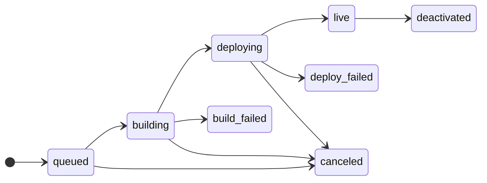

## In progress

| Status | Meaning |
|---|---|
| `queued` | The deploy waits for the previous deploy of the service, or for a free build slot. |
| `building` | Ferry gets the source and builds or pulls the image. |
| `deploying` | Ferry starts the new instances and tests them. |

## Stopped

| Status | Meaning |
|---|---|
| `live` | The deploy gets the traffic. A service has one live deploy at most. |
| `deactivated` | The deploy was live. A newer deploy replaced it. You can [roll back](/docs/concepts/deploys/rollbacks) to it. |
| `build_failed` | Ferry could not get the source, or could not build or pull the image. |
| `deploy_failed` | The image is good, but the new instances did not become healthy. |
| `canceled` | You canceled it, or a newer deploy in the queue replaced it. |

## Find the cause of a failure

A failed deploy has an `error` with the cause. `ferry deploys` and `--follow` show it.

```bash title="Terminal"
ferry deploys api
```

In the dashboard, read the **Why it failed** box. The [deploy log](/docs/concepts/deploys/history) has the full story.
