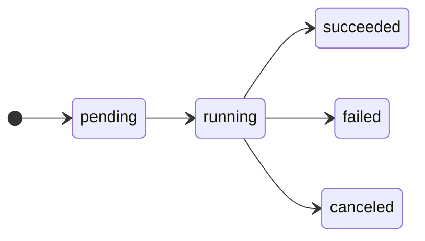

<Terminal
  lines={[
    '$ ferry jobs nightly',
    'ID                         STATUS      TRIGGER   COMMAND     EXIT   STARTED   DURATION',
    'job-d2ef824c6d6c446086e9   canceled    manual    sleep 300   137    1m ago    1m 13s',
    'job-6e08ed29338c4f9bb96c   succeeded   manual    (default)   0      1m ago    0s',
  ]}
/>

The command shows the 20 newest runs, the newest first. Add `-n` to change the number.

The <Term id="trigger" /> of a <Term id="job-run" /> is `schedule` or `manual`. `EXIT` is the <Term id="exit-code" /> of the command.

## The statuses



## Read the log of one run

```bash title="Terminal"
ferry logs --job job-d2ef824c6d6c446086e9 -f
```

`-f` continues while the run is in progress. [Logs & events](/docs/concepts/logs) explains the job logs.

<Accordions>
  <Accordion title="How long Ferry keeps the runs">
    Ferry keeps the newest 100 complete runs of each service, with their logs. It deletes the older runs. To change the number, start `ferryd` with `--keep-job-runs`.
  </Accordion>
</Accordions>
