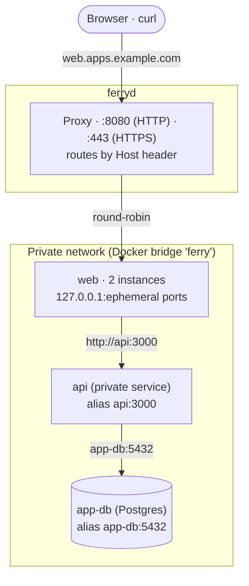

import { Globe, Lock, ShieldCheck } from 'lucide-react';

Every Ferry server runs one reverse proxy. It receives all public traffic, picks a service from the `Host` header and forwards the request to one of the service's containers. Behind the proxy, all containers of the server share a private Docker network where they reach each other by name.



## Public URLs

Web services and static sites are public. Each one is served at `<name>.<domain>` under every [domain of the server](#domains-of-the-server), plus any [custom domains](#custom-domains) you add. A server starts with one domain, its base domain. It comes from `ferryd --base-domain` and defaults to `localhost`, so on your machine an app named `shop` answers at `http://shop.localhost:8080`: browsers resolve every `*.localhost` name to `127.0.0.1`, with no DNS setup.

| Service type | Public URL | Reachable from other services |
|---|---|---|
| Web service | `<name>.<domain>` for each domain of the server, and custom domains | yes, at `<name>:<port>` |
| Static site | `<name>.<domain>` for each domain of the server, and custom domains | yes, at `<name>:80` |
| Private service | none | yes, at `<name>:<port>` |
| Background worker | none | no port (it can still open connections) |
| Cron job | none | no port (each run joins the network) |

The port in public URLs is the proxy port (`--proxy-addr`, default `8080`), or `--public-port` when clients reach the proxy on another port, for example behind port forwarding. It is left out when it is `80`. Once automatic HTTPS is enabled, public URLs use `https://` without a port, except for local names, which never get a certificate and stay on `http://`.

Ferry also routes `ferry.<base-domain>` to the dashboard and API when the base domain is local (`localhost`, `*.localhost`, `*.local`, `*.internal`, `*.test`). On a public base domain this route is off unless you set `--dashboard-host`. See [Production setup](/docs/guides/production) before you enable it.

<Callout type="info" title="Your app must listen on 0.0.0.0 and $PORT">
Ferry publishes each container's port on `127.0.0.1` of the server and forwards requests there. Inside the container, your app must listen on all interfaces (`0.0.0.0`), not `127.0.0.1`. Ferry injects the port it expects as `PORT`; see [Environment](/docs/concepts/environment#the-port-variable).
</Callout>

## How the proxy routes requests

For each request, the proxy:

1. answers ACME HTTP-01 challenges at `/.well-known/acme-challenge/` on plain HTTP, when HTTPS is enabled;
2. answers the [verification of a domain](#domains-of-the-server) at `/.well-known/ferry-domain-check/`, whatever the host;
3. reads the host from the `Host` header (or the HTTP/2 `:authority`), ignoring case, the port and a trailing dot;
4. redirects plain HTTP to HTTPS with a `308` when the host has a certificate;
5. looks up the service that owns the host and picks one of its instances, round-robin;
6. forwards the request over HTTP/1.1 to that instance, with the original `Host` header.

A route only points at instances that accept TCP connections. During a deploy, the proxy switches to the new instances in one step, after they pass their health check. See [Deploys](/docs/concepts/deploys).

If a bodyless `GET` or `HEAD` request can't reach an instance, the proxy retries it once on another instance of the service. Other requests aren't retried.

### Error pages

When the proxy can't forward a request, it answers with its own HTML page and an `x-ferry-error` header, so you can tell it apart from your app's own errors.

| Status | `x-ferry-error` | When |
|---|---|---|
| `400` | `bad_request` | The `Host` header is missing, duplicated or invalid. |
| `404` | `not_found` | No service owns this host (the page says "No service is configured for …"). |
| `405` | `method_not_allowed` | `CONNECT` requests. |
| `408` | `request_timeout` | The client stopped sending its request body for 60 seconds. |
| `503` | `suspended` | The service is [suspended](/docs/concepts/scaling#suspend-and-resume). |
| `503` | `no_upstreams` | The service has no running instance: it was never deployed, its last deploy failed, or a deploy is in progress. Sent with `Retry-After: 5`. |
| `502` | `bad_gateway` | The instance refused the connection or failed mid-request. |

```bash title="Terminal"
curl -sI http://nope.localhost:8080/
# HTTP/1.1 404 Not Found
# x-ferry-error: not_found
```

## Request headers your app receives

The proxy is the edge of your server. It removes the forwarding headers a client sends (`Forwarded`, every `X-Forwarded-*`, `X-Real-IP`, `X-Client-IP` and similar) and sets its own, so your app can trust them:

| Header | Value |
|---|---|
| `Host` | The host the client asked for, port included. |
| `X-Forwarded-For` | The client's IP address only (no chain). |
| `X-Real-IP` | The client's IP address. |
| `X-Forwarded-Proto` | `http` or `https`. |
| `X-Forwarded-Host` | Same as `Host`. |
| `X-Forwarded-Port` | The port in the URL the client used, else `80` or `443`. |
| `Forwarded` | The same facts in RFC 7239 form: `for=…;host=…;proto=…`. |
| `X-Request-Id` | A random id, unless the request already has one. |

This is what an app behind the proxy sees for `curl -H 'X-Forwarded-For: 1.2.3.4' http://echo.localhost:8080/`, where the forged header is gone:

```json title="Headers seen by the app"
{
  "host": "echo.localhost:8080",
  "x-forwarded-for": "127.0.0.1",
  "x-forwarded-proto": "http",
  "x-forwarded-host": "echo.localhost:8080",
  "x-forwarded-port": "8080",
  "x-real-ip": "127.0.0.1",
  "forwarded": "for=127.0.0.1;host=\"echo.localhost:8080\";proto=http",
  "x-request-id": "59f1d9afbc7b4c7f9dda561433c3ab9b"
}
```

Headers set by a CDN, such as `CF-Connecting-IP` or `True-Client-IP`, are passed through unchanged. If you put a CDN or another reverse proxy in front of Ferry, `X-Forwarded-For` holds that proxy's address, and `X-Forwarded-Proto` is `http` when the proxy connects to Ferry over plain HTTP. See [Behind an existing reverse proxy](/docs/guides/production#behind-an-existing-reverse-proxy).

## WebSockets, SSE and streaming

- **WebSockets** and other HTTP/1.1 upgrades are tunnelled to your app. `h2c` upgrades are not: those requests are proxied as plain HTTP/1.1.
- **Server-Sent Events and streamed responses** are passed through as they are produced. A response in progress is never cut by the proxy's timeouts.
- **HTTP/2** is available to clients (over TLS, and over cleartext with prior knowledge). The proxy always talks HTTP/1.1 to your app, so protocols that need HTTP/2 end to end, such as gRPC, don't work through the public proxy. Use the [private network](#private-network) for them.

The proxy protects itself with connection limits. They aren't configurable.

| Limit | Value |
|---|---|
| Open connections | derived from the open-file limit, at most 10,000 (`ferryd` raises its soft limit to the hard limit at startup) |
| Connections per client address | 256 (an IPv6 client counts as its /64; loopback clients are exempt) |
| TLS handshake | 10 s |
| First request head, and each next one on an HTTP/1 connection | 30 s |
| Idle connection without a request in flight | 60 s (5 s while the connection limit is reached) |
| Pause inside a request body | 60 s, then `408` |

## Private network

Ferry creates one Docker bridge network per server, named after the name prefix (`ferry` by default). Every container of the server joins it: service instances, one-off and cron jobs, and datastores. Each service instance gets a DNS alias equal to the service name, and each datastore an alias equal to its name.

So services reach each other by name, without going through the proxy:

```bash
curl http://api:3000/health        # a private service named "api" listening on 3000
psql postgresql://…@app-db:5432/…  # a datastore named "app-db"
```

- A **private service** is only reachable here. It still needs a port: Ferry detects it the same way as for a web service. `ferry show NAME` prints it as the internal address.
- When a service runs several instances, its alias resolves to the addresses of all of them. Docker's DNS answers; Ferry doesn't balance this traffic.
- Rather than hard-coding hosts and ports, use [references](/docs/concepts/environment#references): `${{service.api.hostport}}` becomes `api:3000` when the service starts.
- All services of one server share this network. Ferry doesn't isolate services from each other on it.

```text title="ferry show api (excerpt)"
Internal address:  api:3000
```

## Datastore ports

Each [datastore](/docs/concepts/datastores) also publishes its port on the server, on `127.0.0.1` and a port chosen once when it is created. Its external connection string uses that port, so tools on the server itself (`psql`, a GUI over an SSH tunnel) can connect:

```bash title="Terminal"
ssh -L 62975:127.0.0.1:62975 you@your-server   # then use the external URL on your machine
```

`--advertise-host` only changes the host printed in external connection strings (default `127.0.0.1`). The port stays bound to `127.0.0.1`: datastores are never exposed on a public interface.

## Domains of the server

A domain of the server is a name services are served under: connect `example.com` and every web service and static site also answers at `<name>.example.com`. One wildcard DNS record (`*.example.com`) covers every service, present and future.

```bash title="Terminal"
ferry domains connect example.com   # prints the DNS record to create
ferry domains                       # status of each domain, and what its last verification found
```

- **The base domain** (`--base-domain`) is the first domain of a server. It is always served.
- **A connected domain** starts as `pending`. Ferry verifies it every 15 seconds: it resolves a made-up name under the domain and checks that a request for it comes back to this very server. Once it does, the domain is `active` and every service is served under it, without a deploy.
- **The default domain** is the one service URLs are shown with (the dashboard, `ferry open`, `FERRY_EXTERNAL_URL`). The first domain that reaches a server whose default is a local name becomes the default; change it with `ferry domains default`.
- **A domain whose DNS breaks** is flagged `misconfigured` after three failed checks, and stays served.
- **Local names** (`localhost`, `*.localhost`, `*.local`, `*.internal`, `*.test`) are never verified.

You can do all of this in the dashboard under **Server → Domains**. Follow [Connect a domain](/docs/guides/domains) for the complete procedure.

## Custom domains

Web services and static sites can have extra hostnames. A custom domain is routed as soon as you add it: no deploy is needed.

<Tabs items={['CLI', 'API', 'Blueprint']} groupId="interface" persist>
<Tab value="CLI">

```bash title="Terminal"
ferry domains add shop shop.example.com
# Added shop.example.com. Point its DNS (A/AAAA or CNAME) at this server.
ferry domains shop            # list
ferry domains rm shop shop.example.com
```

</Tab>
<Tab value="API">

```bash title="Terminal"
curl -X POST http://127.0.0.1:7878/api/v1/services/shop/domains \
  -H "Authorization: Bearer $FERRY_TOKEN" \
  -H 'Content-Type: application/json' \
  -d '{"domain": "shop.example.com"}'
```

</Tab>
<Tab value="Blueprint">

```yaml title="ferry.yaml"
services:
  - type: web
    name: shop
    domains: [shop.example.com, www.example.com]
```

</Tab>
</Tabs>

Rules:

- The domain must be a valid DNS name with at least one dot, not an IP address. It is stored lowercase, without a trailing dot.
- A domain belongs to one service. It can't be the default host of any service (`<name>.<domain>` under any domain of the server) or the dashboard host.
- Point the domain's DNS at your server: an `A`/`AAAA` record, or a `CNAME` to a name that resolves to it.

Follow [Custom domains & HTTPS](/docs/guides/custom-domains-https) for the complete procedure.

## Automatic HTTPS

Ferry gets certificates from Let's Encrypt (or any ACME CA) with the HTTP-01 challenge. Turn it on with two `ferryd` options:

```bash title="Terminal"
ferryd --base-domain apps.example.com \
  --proxy-addr 0.0.0.0:80 --https-addr 0.0.0.0:443 \
  --acme-email you@example.com
```

Both are required: `--https-addr` alone doesn't start an HTTPS listener. Then:

- **Which hosts:** every host the proxy routes, except local names (`localhost`, `*.localhost`, `*.local`, `*.internal`, `*.test`) and IP addresses. That is the host of each web service and static site under every domain of the server, every custom domain, and the dashboard host if you set one. Each host gets its own certificate; Ferry doesn't request wildcard certificates.
- **How:** Let's Encrypt connects to the host on port 80 and the proxy answers the challenge. The HTTP listener must therefore be reachable from the internet on port 80, and the DNS name must point at the server.
- **When:** a new hostname gets its certificate within seconds of being routed. A background loop also checks every 60 seconds, orders missing certificates (at most 2 orders at a time) and renews certificates in their last 30 days. After a failure, Ferry waits 5 minutes before the next attempt for that host, then 10, 20, and so on up to 6 hours.
- **Where to look:** `ferry certificates`, or **Server → Domains** in the dashboard, lists every hostname with the state of its certificate: issued (and until when), being requested, or failed, with the reason and the time of the next attempt.
- **Redirects:** once a host has a certificate, plain HTTP requests to it get a `308` redirect to HTTPS. Hosts without a certificate yet are served over HTTPS with a self-signed fallback certificate, so handshakes never hard-fail.
- **Storage:** the ACME account and certificates live in `<data-dir>/certs`, private keys with mode `0600`. They are reloaded at startup.

`--acme-staging` uses the Let's Encrypt staging environment (untrusted certificates, generous rate limits); `--acme-directory` points at another ACME CA. When you switch CAs, certificates issued by the previous one are replaced. See every option on [Server options](/docs/reference/server-options).

<Callout type="warning" title="Use port 443">
With HTTPS on, public URLs are printed as `https://host` without a port. Listen on `0.0.0.0:443` so these URLs work.
</Callout>

<Cards>
  <Card icon={<Globe />} title="Connect a domain" href="/docs/guides/domains" description="Serve every service under a domain of yours, with one DNS record." />
  <Card icon={<Globe />} title="Custom domains & HTTPS" href="/docs/guides/custom-domains-https" description="Add a domain, point DNS at the server and get a certificate." />
  <Card icon={<ShieldCheck />} title="Production setup" href="/docs/guides/production" description="Ports 80 and 443, a wildcard DNS record and a systemd unit." />
  <Card icon={<Lock />} title="Networking model" href="/docs/architecture/networking-model" description="How the proxy, routes and container ports fit together inside ferryd." />
</Cards>
