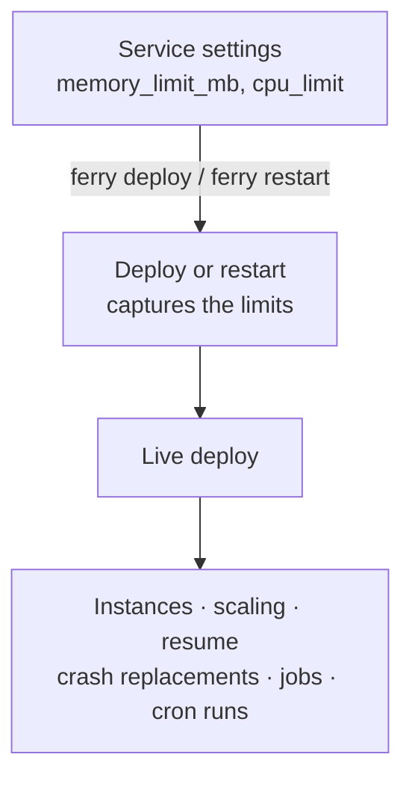

import { Database, Layers, Server } from 'lucide-react';

Every container Ferry starts (service instances, one-off jobs, cron runs and datastores) runs with a memory limit, a CPU limit, a cap on processes and log rotation. An app that leaks memory, spins the CPU, forks without end or floods its logs is killed or slowed down on its own. It can't take down the host, `ferryd` or your databases.

## What's limited

With the default settings, a container that misbehaves runs into these guards:

| When a container… | What happens | Default | Set with |
|---|---|---|---|
| uses too much memory | The kernel kills its process (out of memory), and Docker restarts it; a job run fails instead. There is no swap beyond the limit. | 512 MiB | per service or datastore, else `--default-memory-limit` |
| spins the CPU | It is throttled at its CPU quota. The other cores stay free. | 1 CPU | per service or datastore, else `--default-cpu-limit` |
| forks without end | `fork` fails inside the container at this many processes and threads. The host's process table is untouched. | 1024 | `--pids-limit` |
| logs without end | Docker's `json-file` log rotates: at most about 30 MiB per container. | 10 MiB × 3 files | `--log-max-size`, `--log-max-files` |
| is deployed onto a nearly full disk | The deploy, or a new datastore, fails before building or pulling anything. | 1 GiB free | `--min-free-disk` |

Limits apply **per container**. They aren't shared: a service with 3 instances can use 3 times its limit, plus its running jobs. They are caps, not reservations: nothing checks that all the limits together fit on the host. Builds aren't limited at all (see [What isn't limited](#what-isnt-limited)).

## Server defaults

A service or datastore that sets no limits of its own gets the server defaults. Set them with `ferryd` flags or their environment variables:

```bash title="Terminal"
ferryd --default-memory-limit 1G --default-cpu-limit 2
FERRY_DEFAULT_MEMORY_LIMIT=1G FERRY_DEFAULT_CPU_LIMIT=2 ferryd   # the same
```

- **Memory sizes:** `512`, `512M`, `1G`, `1.5G`, `2GiB`. A plain number is MiB. Like in Docker, `M`, `MB` and `MiB` all mean MiB, and `G`, `GB` and `GiB` all mean GiB.
- **CPU amounts:** `0.5` is half a core, `2` is two cores, `500m` is 500 millicores (0.5). Amounts are rounded to 0.01 CPU.
- **`0` turns a guard off:** with `--default-memory-limit 0` or `--default-cpu-limit 0`, containers that set no limit of their own are unlimited. `--pids-limit 0`, `--log-max-size 0` and `--min-free-disk 0` turn off the other guards.

`ferryd` refuses to start on an invalid value, naming the flag, and warns when a default is more than the Docker host has. Its startup banner shows what applies:

```text title="ferryd output (excerpt)" noCopy
  Docker          : 28.3.3 (8 CPUs, 7.7 GiB)
  Data            : ./ferry-data
  Limits          : 512 MiB / 1 CPU per container (default), 1024 pids, logs rotated at 10 MiB × 3
  Free disk check : deploys need 1 GiB free
```

[`ferry info`](/docs/reference/cli#ferry-info) and the dashboard's **Server** page show the defaults next to the size of the Docker host:

```text title="ferry info (excerpt)" noCopy
Default limits:  512 MiB memory, 1 CPU per container
Docker host:     8 CPUs, 7.7 GiB memory
```

<Callout type="warning" title="Small servers">
On a server with a single CPU, the default CPU limit of 1 CPU is the whole host. Lower `--default-cpu-limit` there, for example to `0.5`.
</Callout>

Every flag is listed in [Server options](/docs/reference/server-options).

## Limits of a service

A service's limits apply to **each** of its instances and to each of its job runs, one-off or scheduled. A limit can be 16 MiB to 1 TiB of memory, and 0.01 to 512 CPUs.

<Tabs items={['CLI', 'Dashboard', 'API', 'Blueprint']} groupId="interface" persist>
<Tab value="CLI">

`ferry create`, `ferry update` and `ferry up` take `--memory` and `--cpu`:

```bash title="Terminal"
ferry create api --repo https://github.com/you/api --memory 1G --cpu 0.5
ferry update api --memory 2G           # change it
ferry update api --cpu default         # back to the server default
ferry up --memory 768M                 # ferry up takes them too
```

```text title="ferry update api --memory 2G" noCopy
Updated 'api'
Resource limits apply to the next deploy or restart: ferry restart api
```

`default` (or `0`) means the server default. [`ferry show`](/docs/reference/cli#ferry-show) prints the limits the service has:

```text title="ferry show api (excerpt)" noCopy
Memory limit:      2 GiB
CPU limit:         server default (1 CPU)
```

</Tab>
<Tab value="Dashboard">

- **New service:** open **Advanced** and pick a **Memory limit** and a **CPU limit**.
- **Existing service:** **Settings** → **Resources**, then **Save changes**.

Each limit is a menu: **Server default** (with the server's value), presets from 256 MiB to 8 GiB or from 0.25 to 4 CPUs, or **Custom…** to type a size such as `768M` or `1500m`. CPU presets above the Docker host's CPUs are disabled, and memory presets above its memory are flagged.

After a save, the confirmation offers **Restart now** when the service is live, so the running instances get the new limits.

</Tab>
<Tab value="API">

```bash title="Terminal"
curl -X PATCH http://127.0.0.1:7878/api/v1/services/api \
  -H "Authorization: Bearer $FERRY_TOKEN" \
  -H 'Content-Type: application/json' \
  -d '{"memory_limit_mb": 2048, "cpu_limit": 0.5}'
```

`memory_limit_mb` is in MiB and `cpu_limit` in CPUs; `0` goes back to the server default. `POST /api/v1/services` takes the same fields. The request only saves the limits: it doesn't redeploy. See [Update a service](/docs/reference/api/services#update-a-service).

</Tab>
<Tab value="Blueprint">

```yaml title="render.yaml"
services:
  - type: web
    name: api
    plan: standard        # 2 GiB / 1 CPU
    cpuLimit: 500m        # but only half a core
  - type: worker
    name: jobs
    memoryLimit: 1G
```

A Render `plan` becomes limits, and Ferry's own keys `memoryLimit` and `cpuLimit` override it. See [Blueprints and Render plans](#blueprints-and-render-plans).

</Tab>
</Tabs>

### When a change applies

Ferry captures a service's limits when a deploy or a restart starts its instances, together with the image, environment and command. Everything that starts containers later reuses that live deploy: scaling, resuming, the [reconciler](/docs/concepts/self-healing) replacing a crashed instance, one-off jobs and cron runs.



So a change only reaches running containers with the next deploy or restart. A restart is enough: it reuses the live image, without building anything.

```bash title="Terminal"
ferry update api --memory 2G
ferry restart api --follow
```

The deploy log names the limits the new instances get (`per run` for a cron job):

```text title="Deploy log (excerpt)" noCopy
==> Using port 10000 (default port)
==> Limits: 2 GiB memory, 1 CPU per instance
==> Starting 1 instance(s)
```

A blueprint apply is the exception: it restarts every live service whose limits changed, by itself.

## Limits of a datastore

A datastore's limits apply to its one container. Unlike a service's, they change **in place**: the running container gets them right away, without a restart.

<Tabs items={['CLI', 'Dashboard', 'API', 'Blueprint']} groupId="interface" persist>
<Tab value="CLI">

```bash title="Terminal"
ferry db create cache --kind redis --memory 256M
ferry db update app-db --memory 2G --cpu 1
ferry db update app-db --cpu default         # back to the server default
```

```text title="ferry db update app-db --memory 2G --cpu 1" noCopy
Updated datastore 'app-db': memory limit 2 GiB, CPU limit 1 CPU
Applied to the running container (no restart).
```

[`ferry db show`](/docs/reference/cli#ferry-db-show) prints the current limits as `Memory limit` and `CPU limit`.

</Tab>
<Tab value="Dashboard">

- **New datastore:** the dialog has an optional **Memory limit** and **CPU limit**.
- **Existing datastore:** its page has a **Resources** section. **Apply limits** changes the running container right away.

</Tab>
<Tab value="API">

```bash title="Terminal"
curl -X PATCH http://127.0.0.1:7878/api/v1/datastores/app-db \
  -H "Authorization: Bearer $FERRY_TOKEN" \
  -H 'Content-Type: application/json' \
  -d '{"memory_limit_mb": 2048}'
```

Both fields are optional: an omitted one keeps its value, and `0` goes back to the server default. `POST /api/v1/datastores` takes the same fields. See [Change a datastore's resource limits](/docs/reference/api/datastores#change-a-datastores-resource-limits).

</Tab>
<Tab value="Blueprint">

```yaml title="render.yaml"
databases:
  - name: app-db
    plan: basic-1gb       # 1 GiB of memory
    cpuLimit: 2
services:
  - type: keyvalue
    name: cache
    memoryLimit: 256M
```

An apply changes the limits of existing datastores in place too.

</Tab>
</Tabs>

- **Whatever its status:** the limits of a `creating` datastore apply to its container, or it is created with them. A `failed` datastore, for example one that ran out of memory, keeps the new limits for its next start.
- **Lowering the memory** below what the datastore uses right now can fail, or get it killed for running out of memory. If applying the new limits fails, they are saved anyway and the error says so; running the same update again retries.
- **Redis** gets a `maxmemory` of 3/4 of its memory limit: 192 MiB for a 256 MiB limit. When it's full, Redis refuses writes instead of being killed by the kernel; the other quarter is headroom for saving its append-only file and for client buffers. Ferry sets it when Redis starts and again when you change the limit. A Redis without a memory limit gets no `maxmemory`.

## Blueprints and Render plans

In a `render.yaml` or `ferry.yaml`, the `plan` of a service or database becomes its limits. Services get Render's memory and CPU, except `free`, which gets 0.5 CPU like `starter` instead of Render's 0.1 (a tenth of a core only makes an app slow on your own server):

| Service plan | Memory | CPU |
|---|---|---|
| `free`, `starter` | 512 MiB | 0.5 CPU |
| `standard` | 2 GiB | 1 CPU |
| `pro` | 4 GiB | 2 CPUs |
| `pro plus` | 8 GiB | 4 CPUs |
| `pro max` | 16 GiB | 4 CPUs |
| `pro ultra` | 32 GiB | 8 CPUs |

- **Postgres** (`databases`): the plan sets the memory only. `basic-256mb`, `basic-1gb`, `basic-4gb`, `pro-<size>` and `accelerated-<size>` get that size (`pro-16gb` → 16 GiB); the legacy `free` and `starter` get 256 MiB, `standard` 1 GiB, `pro` 4 GiB and `pro plus` 8 GiB.
- **Key Value** (`type: redis` or `keyvalue`): the memory only. `free` and `starter` get 256 MiB, `standard` 1 GiB, `pro` 5 GiB and `pro plus` 10 GiB.
- **Static sites** have no plans: their `plan` is ignored, but `memoryLimit` and `cpuLimit` apply.
- Plan names ignore case and separators: `pro plus`, `Pro_Plus` and `pro-plus` are the same plan. An unknown plan is a warning, and the entry gets no limits from it.

`memoryLimit` and `cpuLimit` take the same sizes as the CLI (`768M`, `1.5G`, `500m`) and override the plan key by key. `0` means the server default. An existing service or datastore whose entry sets none of `plan`, `memoryLimit` and `cpuLimit` keeps its current limits.

A dry run lists the limit changes, and the apply restarts the live services they concern:

```text title="ferry blueprint apply render.yaml --dry-run" noCopy
Blueprint render.yaml — dry run, nothing was changed

Would update:
  ~ service api
      - memory_limit: (server default) → 2 GiB
      - cpu_limit: (server default) → 1 CPU

Run without --dry-run to apply.
```

See the [Blueprint spec](/docs/reference/blueprint) for every key.

## Out-of-memory kills

When a container goes over its memory limit, the kernel kills its process. What follows depends on the container:

| Container | What happens | The message |
|---|---|---|
| Instance of a live service | Docker restarts it. `ferry status` and the dashboard flag it while it restarts; `ferryd` logs the kill. | `instance a1b2c3 of service 'api' ran out of memory (limit 512 MiB) — raise the service's memory limit` (server log) |
| New instance during a deploy | The deploy fails, even when Docker already restarted the instance. | `instance ab12cd ran out of memory (limit 512 MiB) — raise the service's memory limit` |
| Job run | The run fails. | `the job ran out of memory (limit 64 MiB) — raise the service's memory limit` |
| Datastore being provisioned | The datastore goes `failed`. | `the redis container ran out of memory (limit 256 MiB) — raise the datastore's memory limit` |
| Running datastore | `ferryd` logs the kill. If the datastore stops, Docker restarts it. | `datastore 'app-db' ran out of memory (limit 1 GiB) — raise the datastore's memory limit` (server log) |

[`ferry status`](/docs/reference/cli#ferry-status) shows each instance's usage against its limits, marks the instances that were killed and says how to fix it:

```text title="ferry status api" noCopy
api: degraded — 1/2 instance(s) running
INSTANCE   DEPLOY     STATE                                    PORT    CPU              MEMORY                  RESTARTS   STARTED
3f2a1c     7d0e52aa   running                                  63012   2.1% / 0.5 CPU   301.4 MiB / 512.0 MiB   0          12m ago
9b4e07     7d0e52aa   restarting (OOM killed, exit code 137)   -       -                -                       3          -
note: instance 9b4e07 was killed for running out of memory (limit 512 MiB). Raise the limit with 'ferry update api --memory <SIZE>', then 'ferry restart api'.
```

On the service's **Overview**, the instance card shows an **OOM killed** badge with the exit code, and a **Raise the limit** link to **Settings** → **Resources**. The API reports the same as `oom_killed` and `exit_code` in [Runtime status](/docs/reference/api/services#runtime-status).

To fix it, raise the limit and restart, or find the leak:

```bash title="Terminal"
ferry update api --memory 1G
ferry restart api
ferry db update cache --memory 512M     # a datastore: no restart needed
```

- **The flag doesn't last.** Docker clears it as soon as the container runs again, so `ferry status` only shows it while the instance is restarting or stopped. Past kills stay in the server log (`journalctl -u ferryd` under systemd).
- **Exit code 137 alone isn't proof.** It only means the process got `SIGKILL`. Ferry relies on Docker's out-of-memory flag instead: without it, a deploy reports `instance ab12cd crashed (exit code 137: killed by SIGKILL)`, and `ferry status` shows the exit code without `OOM killed`.
- **No limit, still killed:** a container without a memory limit is only killed when the whole host runs out of memory: `… was killed by the kernel's out-of-memory killer (it has no memory limit: the Docker host ran out of memory)`.

### When the host runs out of memory

Limits are caps, so the containers together can still use more memory than the server has. The kernel then picks a process to kill. On Linux, `ferryd` lowers its own OOM score at startup (`--oom-score-adj`, default `-500`) so the kernel kills containers before it. It never raises a lower value already set, such as systemd's `OOMScoreAdjust=-900`.

Lowering the score needs root or `CAP_SYS_RESOURCE`. Without them, `ferryd` logs a warning: set `OOMScoreAdjust=` in its systemd unit instead, as [Production setup](/docs/guides/production) does, and pass `--oom-score-adj 0` to silence the warning. The processes `ferryd` starts (git, the docker CLI) are reset to 0, so a runaway `git` isn't spared, and containers never inherit it. On other systems the flag does nothing.

## CPU limits and the host

`ferryd` reads the Docker host's CPUs, memory and features once, and adjusts the limits to what the host can do:

- **More CPU than the host has:** Docker refuses such a container, so Ferry caps the limit at the host's CPU count and says so: `the CPU limit (8 CPUs) is more than the Docker host has: capped at 4 CPUs`. The warning goes to the deploy log and the server log; for a job, to its job log; for a datastore, to the server log.
- **More memory than the host has:** Docker accepts it, but the limit protects nothing. Ferry only warns: in the deploy log, the job log, or the server log for a datastore.
- **No CPU quota support:** some kernels (some NAS and ARM boards, rootless Docker without the cgroup v2 `cpu` controller delegated) have no CPU CFS quotas, and Docker refuses every CPU limit there. Ferry then sets none: `ferryd` warns at startup, and each deploy says `the CPU limit (1 CPU) is not enforced: the Docker host's kernel has no CPU CFS quota support`.

The host's size is read once. After resizing Docker Desktop's virtual machine, restart `ferryd`.

## Processes and logs

- **Pids limit:** each container can run at most `--pids-limit` processes and threads together (default 1024). A fork bomb stops there, with `fork` failing inside the container. Raise it for apps that really run thousands of threads.
- **Log rotation:** when the Docker daemon's default log driver is `json-file` (Docker's default), Ferry rotates each container's log at `--log-max-size` (10 MiB) and keeps `--log-max-files` files (3, the current one included). [Runtime logs](/docs/concepts/logs#runtime-logs) only go back as far as those files. A daemon set up with another driver (journald, syslog, fluentd, `local`…) keeps it, with that driver's own limits; `ferryd`'s banner then says `Docker's journald log driver (kept)`. `--log-max-size 0` leaves the daemon's log settings alone.

## Free disk space

Builds, image pulls and new datastore volumes fill the disk. Before a deploy builds or pulls (a Git, upload or image deploy) and before a new datastore is created or its image pulled, Ferry checks the free space on the filesystem of the data directory, and on that of the Docker root directory when it is on the same machine (not with Docker Desktop, whose root lives in its virtual machine). Below `--min-free-disk` (default `1G`), the deploy fails as `build_failed`, or the datastore as `failed`:

```text title="Deploy log" noCopy
==> Build failed: not enough free disk space on /srv/ferry: 812 MiB free, Ferry needs at least 1 GiB (free some space, e.g. remove unused Docker images with `docker image prune`, or change the threshold with `ferryd --min-free-disk`, 0 = off)
```

Restarts and rollbacks reuse an image, so they are never checked. Neither is recreating the container of an existing datastore, unless its image has to be pulled again: the reconciler can still heal it on a full disk. The check only runs on Unix systems.

## What isn't limited

- **Builds.** `docker build` runs in BuildKit, which has no per-build memory or CPU limit: a build can still use all of the host's memory and CPU. Only `--build-concurrency` (default 2) bounds builds, and the free-disk check runs before a build, not during it.
- **Disk space.** Volumes (datastores, [service disks](/docs/concepts/scaling#persistent-disks)), container filesystems, images and the build cache have no quotas. The free-disk check only stops new deploys and new datastores. `--keep-images` bounds Ferry's own images; prune the rest yourself (`docker image prune`, `docker builder prune`).
- **Disk and network I/O.** There are no I/O or bandwidth limits.
- **The network.** Every service and datastore shares one [private network](/docs/concepts/networking#private-network): any container can reach every other one by name, and datastores are protected by their passwords only.
- **Overcommit.** Nothing checks that the sum of all limits fits the host (see [When the host runs out of memory](#when-the-host-runs-out-of-memory)).

## Upgrading from a Ferry without limits

- **Running containers keep running without limits** until they are replaced. A deploy or restart then captures the service's limits: the server defaults (512 MiB, 1 CPU) unless you set others. Until then, scaling and crash replacements start containers from the deploy made before the upgrade, with the server defaults.
- **Datastores** also keep running without limits until you change their limits, they are provisioned again (for example retried after a failure) or their container is recreated. Nothing is applied when `ferryd` starts.
- **Blueprints:** `plan` used to be ignored. The first apply of an existing `render.yaml` after the upgrade restarts every live service that has a `plan`, with that plan's limits, and changes the limits of datastores that have one.

<Callout type="warning" title="Set limits before the defaults reach a big app">
An app or database that needs more than 512 MiB gets killed once it runs with the default limit. Right after upgrading, give it enough. For a service, `ferry update NAME --memory 2G`, then `ferry restart NAME`. For a datastore, `ferry db update NAME --memory 2G`: it applies right away, and puts that limit on its running container. You can also raise `--default-memory-limit`.
</Callout>

<Cards cols={3}>
  <Card icon={<Layers />} title="Disks, scaling & suspend" href="/docs/concepts/scaling" description="Instances, restarts and persistent disks." />
  <Card icon={<Database />} title="Datastores" href="/docs/concepts/datastores" description="Managed Postgres and Redis." />
  <Card icon={<Server />} title="Server options" href="/docs/reference/server-options" description="Every ferryd flag and environment variable." />
</Cards>
