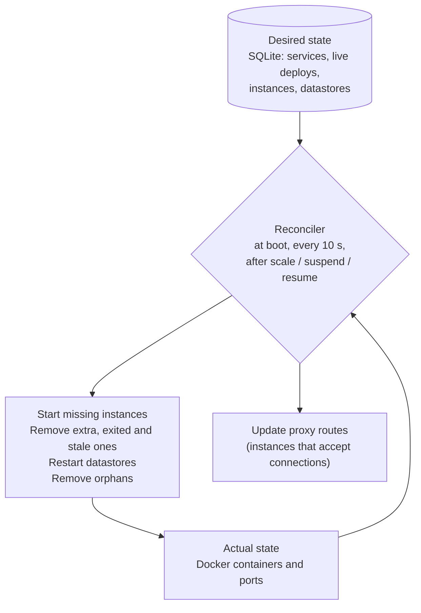

import { Cpu, Layers, Server } from 'lucide-react';

Ferry stores what should run (services, their live deploys, instance counts, datastores) in its SQLite database. A **reconciler** compares that desired state with what Docker actually runs and fixes the difference. You don't restart crashed apps or clean up leftovers by hand.



## What the reconciler does

It runs once at boot, 2 seconds later, then every 10 seconds, and right after you scale, suspend or resume a service. For each service, it:

- keeps the running containers of the **live deploy**, up to the number of instances you asked for;
- removes exited or dead containers, extra instances, and containers of any other deploy. Containers of deploys that never went live (failed, canceled, interrupted) are removed at once; the others get a 10-second stop grace period;
- starts the missing instances from the live deploy's snapshot: the same image, environment, command, port and disk as the deploy. Settings you changed since don't apply until the next deploy or restart;
- installs the proxy routes: the instances that accept TCP connections, or the `503` page for suspended services and services with no instance up.

It skips a service while one of its deploys is starting and health-checking instances: that deploy is in charge.

Beyond services, each pass also:

- restarts or recreates [datastores](/docs/concepts/datastores#self-healing) whose container stopped or vanished (their volumes keep the data), and retries failed ones with a growing delay;
- removes **orphans**: containers of this server whose service or datastore no longer exists, and leftover job containers;
- removes the routes of deleted services.

Between passes, a route watcher lists the running instances every second. When Docker restarts a container on a new port, the route follows within about a second.

## When a container crashes

Service containers run with Docker's `unless-stopped` restart policy.

- **The process exits or crashes:** Docker restarts the container right away. It may come back on a new host port; the route watcher updates the route as soon as it accepts connections.
- **The container disappears** (removed by hand, or its restart failed): the next reconciler pass starts a replacement, within about 10 seconds.

Meanwhile, the proxy sends traffic to the other instances. With a single instance, requests get `503` until the instance is back. `ferry status` shows the restart count of each instance, and the service state is `degraded` while fewer instances run than you asked for.

<Callout type="info" title="Only TCP is checked after a deploy">
The health-check path (`--health`) is checked while a deploy starts new instances. After that, the proxy only checks that an instance accepts TCP connections. An app that hangs but keeps its port open stays in the rotation: make it exit when it can't serve, and Docker restarts it.
</Callout>

## When the server restarts

Stopping `ferryd` doesn't stop your apps: service and datastore containers keep running. While it is down, though, nothing proxies public traffic, cron schedules don't fire (missed runs are skipped, not caught up) and no deploy runs. Services still reach each other and their datastores on the private network.

When `ferryd` starts, it:

1. marks deploys that were still queued, building or deploying as `build_failed` or `deploy_failed`, with the error "interrupted by server restart", and job runs that were still going as `failed`;
2. installs the routes of every service **before** the proxy accepts connections, so running apps are served again immediately;
3. finishes converging in the background: removes the containers of interrupted deploys, starts missing instances, restarts datastores;
4. starts the reconciler loop, the route watcher and the cron scheduler, and resumes provisioning of datastores that were still being created.

Interrupted deploys aren't retried. Start them again with `ferry deploy NAME`.

## Graceful shutdown

On the first `SIGINT` (Ctrl-C) or `SIGTERM`, `ferryd` shuts down in order:

1. the API stops accepting requests and waits up to 10 seconds for requests in progress; log streams and the change feed end;
2. the proxy stops accepting connections and drains the open ones;
3. the engine fails queued deploys, stops deploys in progress (removing their new instances; the live deploy keeps its containers), and stops running jobs with a 10-second grace period, recording them as `failed` ("interrupted by server shutdown"). It gets up to 25 seconds.

A second signal exits immediately (exit code 130). Under systemd, give the service enough time to stop, for example `TimeoutStopSec=60`.

## One server per data directory and prefix

Two protections keep two servers from managing the same resources:

- **Data directory lock.** `ferryd` holds an exclusive lock on `<data-dir>/ferryd.lock` while it runs. A second server with the same data directory refuses to start:

  ```text
  Error: another ferryd is already running with data directory /var/lib/ferry
  ```

- **Name prefix ownership.** All Docker resources of a server carry its name prefix (`--name-prefix`, default `ferry`), and the reconciler removes whatever it considers orphaned under that prefix. So each prefix belongs to one data directory, recorded on a marker volume `<prefix>-owner`. A server whose data directory doesn't own the prefix refuses to start, and so does a server with an empty data directory that finds existing containers under its prefix:

  ```text
  Error: Docker resources with prefix 'ferry' belong to another Ferry server (data dir /var/lib/ferry). Run this server with a different --name-prefix, stop the other server, or pass --take-over to adopt the resources (the other server's containers will then be managed — and possibly removed — by this one).
  ```

  Pass `--take-over` only when you really mean to adopt the resources, for example after restoring a data directory without its `instance_id` file. See [Multiple servers](/docs/guides/multiple-servers#move-a-server-to-another-data-directory).

<Cards cols={3}>
  <Card icon={<Cpu />} title="Reconciler internals" href="/docs/architecture/reconciler" description="How a pass is implemented." />
  <Card icon={<Layers />} title="Disks, scaling & suspend" href="/docs/concepts/scaling" description="Instance counts the reconciler maintains." />
  <Card icon={<Server />} title="Production setup" href="/docs/guides/production" description="Run ferryd under systemd." />
</Cards>
