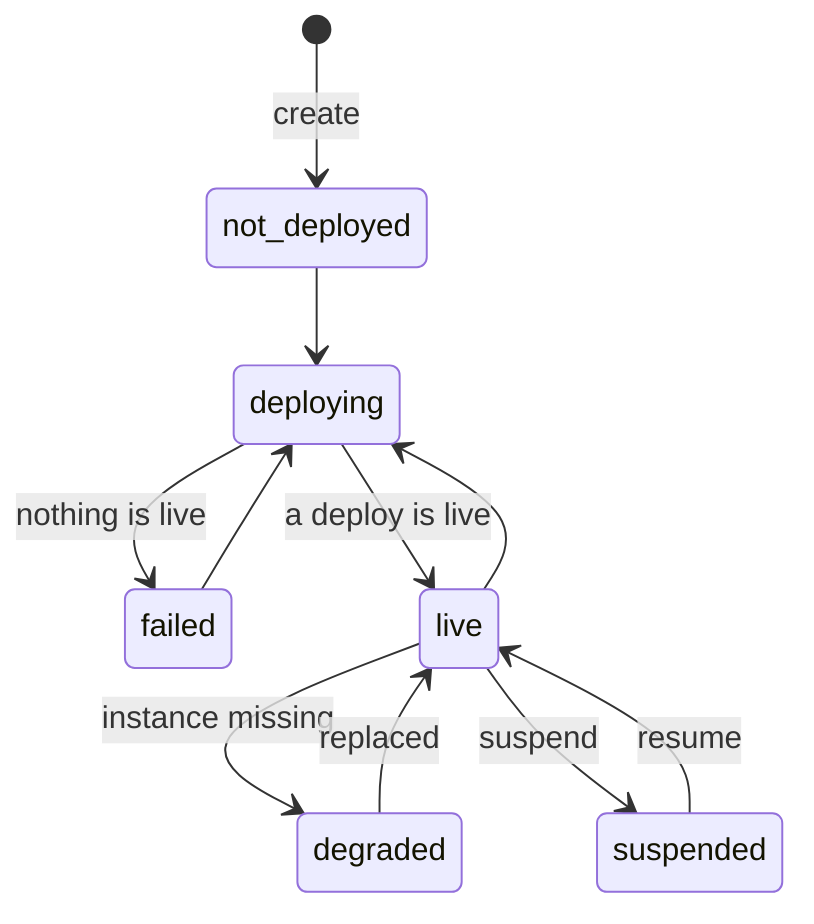

## The six states

| <Term id="service-state">State</Term> | Meaning |
|---|---|
| `not_deployed` | No deploy was a success, and no deploy is in progress. |
| `deploying` | The newest deploy is `queued`, `building` or `deploying`. |
| `live` | A <Term id="deploy" /> is live and all the <Term id="instance">instances</Term> run. For a cron job: the image is ready and the schedule is active. |
| `degraded` | A deploy is live, but some instances do not run. Example: Ferry replaces a container that crashed. |
| `failed` | The newest deploy failed and no deploy is live. |
| `suspended` | You [suspended](/docs/concepts/scaling) the service. No container runs and the proxy answers 503. |

## During a deploy

Each deploy moves the service to `deploying` while it runs. This is true for a manual deploy, a push, a restart and a rollback.

## If a deploy fails on a live service

The state of the service does not change. The previous deploy continues to answer, and the service goes back to `live`.

The deploy shows the failure. Use the **Deploys** page, or this command:

```bash title="Terminal"
ferry deploys api
```
