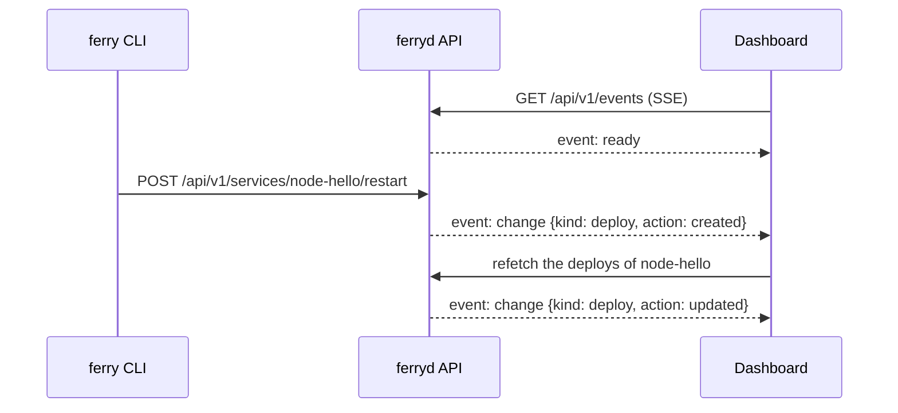

import { Boxes, Braces, Terminal } from 'lucide-react';

The web dashboard is built into `ferryd`. Everything you can do from the CLI, you can do here too: create and deploy services, follow build logs, roll back, edit variables, manage datastores and env groups, apply blueprints. Changes made anywhere (CLI, API, webhooks, another browser tab) show up on screen within about a second.

## Open the dashboard

With the default settings, the dashboard is at:

- http://127.0.0.1:7878, the API address;
- http://ferry.localhost:8080, through the public proxy (on by default for local base domains such as `localhost`).

Sign in with the API token that `ferryd` printed on first start (it is also in `<data-dir>/api_token`). The browser keeps the token in local storage until you sign out. On a remote server, open an SSH tunnel first (`ssh -L 7878:127.0.0.1:7878 you@your-server`), or expose the dashboard over HTTPS as described in [Production setup](/docs/guides/production).

<Callout type="warning" title="The dashboard is the admin API">
Whoever can sign in to the dashboard controls the whole server. On a public domain, `ferryd` does not route the dashboard through the proxy unless you pass `--dashboard-host`; only do so with HTTPS enabled.
</Callout>

## Layout

Every screen shares the same frame:

- **Top bar.** A breadcrumb with the server (base domain and version) and, on a service, a switcher to jump to another service plus its type and state. On the right: **Connect**, **Docs**, the search field (<kbd>⌘</kbd>+<kbd>K</kbd> or <kbd>Ctrl</kbd>+<kbd>K</kbd>), the theme menu (light, dark or system), help, and **Sign out**.
- **Icon rail** on the left: **Services**, **Datastores**, **Env groups**, **Blueprints** and **Server**. The button at the bottom shows or hides the labels. On a phone, the rail becomes a menu button in the top bar.
- **Connect** opens a panel with everything a client needs: the `ferry login` command for this server (it includes your token), the API URL, and on a service page its URL, private address and deploy hook, each with a copy button.
- **Command palette** (<kbd>⌘</kbd>+<kbd>K</kbd>): jump to any service, datastore, env group or page; open a service's sections; start a **Manual deploy** or **Restart service** on the current service; create a service; switch the theme; sign out.

## Services

The home screen lists every service as a card: name, source (repository and branch, image, or "Upload via ferry up"), badges for the type, runtime and instance count, the public URL, private address or cron schedule, and a status line such as **Service is live** with the time of the last deploy.

- As long as no GitHub or GitLab account is connected to the server, the page starts with **Connect GitHub** and **Connect GitLab**: authorize the server on the provider's own page, and new services pick their repository and branch from a list. See [Connect GitHub or GitLab](/docs/guides/git-accounts). **Not now** hides the prompt.
- **Search** by name, filter by **Status** (live, deploying, degraded, failed, suspended, not deployed), sort by name or last deploy, and switch between grid and list views.
- The **⋮** menu on a card: open the service, deploy it, restart it, suspend or resume it, copy its URL, or delete it.
- The **Ferry server** panel on the right shows the Ferry and Docker versions, the proxy address, how many services, datastores and env groups exist, and how many instances are running. Its footer says **Live updates** while the change feed is connected.

### New service

**+ New service** opens a single form:

1. **Service type:** web service, private service, background worker, cron job or static site (see [Services](/docs/concepts/services)).
2. **General:** the name, with a preview of the public URL it will get.
3. **Source:** a **Git repository**, a **Docker image**, or **Upload later** to create the service now and push code with `ferry up`. For a git repository, **Connected account** lists the repositories of a [connected GitHub or GitLab account](/docs/guides/git-accounts) (search and pick one; **Add account** authorizes another one on the provider's page and brings you back to the form as you left it), and **Repository URL** takes any git URL. Either way, **Branch** is a list read from the repository itself, and both have the auto-deploy switch.
4. **Build & deploy:** runtime (auto-detect or a specific one), build command, start command (or the command and schedule of a cron job, or the publish directory of a static site), port and instances. **Advanced** adds the root directory and Dockerfile path for monorepos, the health check path, a persistent disk, and the memory and CPU limits of each instance (see [Resource limits](/docs/concepts/resource-limits)).
5. **Custom domains**, **Environment** variables (add them one by one, import a `.env` file, or insert a datastore reference) and **Env groups** to link.

**Create and deploy** creates the service and queues its first deploy when it has a source.

## A service

Opening a service shows its name, state, type and URL in the header, with **Open** and a **Manual deploy** button. The arrow next to **Manual deploy** offers the deploy itself (deploy the latest commit, pull the image again, or redeploy the last upload), **Clear build cache & deploy** for services that are built, **Restart service** and **Suspend service**. A side menu leads to the service's sections.

### Overview

- **Info tiles:** status, running instances, private address (`name:port`), source, latest deploy, runtime, domains and creation date.
- **Dependencies:** a small graph of the env groups linked to the service and the datastores and services its variables reference, such as `app-db` "via `DATABASE_URL`".
- **Instances:** live CPU and memory of each container against its limits, with a **Scale** button. An instance the kernel killed for going over its memory limit gets an **OOM killed** badge with its exit code, and a **Raise the limit** link to **Settings** → **Resources**.
- **Service availability:** manual deploy (with a **Clear build cache** option), restart, scale, run a one-off job, and suspend or resume.

### Deploys

The history of every build and rollout, newest first: status, deploy id and trigger (upload, manual deploy, rollback, restart, environment change…), source (commit, uploaded archive, image, or "Reused image from dep-…"), image, duration and age. The row menu opens a deploy, offers **Roll back to this deploy** on earlier deploys that went live, and **Cancel deploy** on one in progress.

A deploy's page shows its trigger, source, commit, image, timestamps, duration and port; a **Why it failed** box with the error when it failed; and the **Build & deploy log**, which streams live until the deploy finishes. See [Deploys](/docs/concepts/deploys).

### Logs

The stdout and stderr of the running instances, merged and streamed live. Choose how much history to load (last 100, 500 or 1000 lines, or all), pause or resume the stream, search, wrap lines, show or hide timestamps and the instance column, and download what's on screen. Scrolling up pauses auto-scroll; **Jump to latest** resumes it. See [Logs & events](/docs/concepts/logs).

### Jobs

The one-off jobs and cron runs of the service: status, command, trigger (manual or schedule), exit code, duration and start time. **Run job** (**Run now** on a cron job) starts a command in a new container from the live deploy's image; a job page streams its output, and running jobs can be canceled. On a cron job, a card shows the schedule in plain words (for example "Every day at 03:00 UTC") with an **Edit schedule** shortcut. See [Jobs & cron](/docs/concepts/jobs).

### Environment

- **Service variables:** a key/value editor. Values are hidden until you click **Reveal**; **Copy .env** copies them all. Add variables, import a `.env` file, or paste `KEY=value` lines into a key field. **Save only** stores them for the next deploy or restart; **Save & restart** applies them right away.
- **Linked environment groups:** link or unlink groups. Groups are merged in link order.
- **Effective environment:** what the next deploy or restart will give the containers, with the source of each variable (the service or a group). **Show Ferry variables** adds the ones Ferry injects, such as `PORT`.
- **Reference syntax:** a reminder of `${{datastore.NAME.connectionString}}` and `${{service.NAME.hostport}}`, with the references you can insert for your datastores and services.

See [Environment & env groups](/docs/concepts/environment).

### Settings

| Section | What you can change |
|---|---|
| General | Nothing: name, id, type, private address and creation date, with copy buttons |
| Build & deploy | Source (git, image or upload), the branch (a list read from the repository; the section also says which [connected account](/docs/guides/git-accounts) clones it), runtime, root directory, Dockerfile path, build command, start command, publish directory, port, health check path, auto-deploy. Applies on the next deploy. |
| Cron schedule | The schedule of a cron job, with common presets |
| Scaling | Instances (applied immediately, no deploy) and the disk mount path |
| Resources | Memory limit and CPU limit of each instance (of each run, for a cron job) and of the service's jobs: **Server default**, a preset or **Custom…**. Applies on the next deploy or restart; on a live service, **Restart now** in the confirmation applies it right away. |
| Custom domains | Add or remove domains; lists every host routed to the service |
| Deploy hook | Copy the secret deploy URL, or regenerate it (the old URL stops working) |
| Danger zone | Suspend or resume, and delete the service |

If a setting changes elsewhere while you are editing the form, a **These settings changed elsewhere** notice lets you keep your edits or load the latest values, so you never overwrite someone else's change by accident.

## Datastores

Managed PostgreSQL and Redis instances, as cards with their version, private address, status and the host port they are published on. Filter by **Type** or search, and create one with **New datastore** (name, kind, version, for Postgres an optional database name and user, and optional memory and CPU limits).

A datastore's page shows:

- **Connection:** status, internal address, internal and external connection strings, username, password and database, each with a copy button.
- **Resources:** the memory and CPU limits of its container. **Apply limits** changes the running container right away, without a restart.
- **Use in a service:** the reference to paste into an environment, for example `DATABASE_URL=${{datastore.app-db.connectionString}}`, and a table of every property you can reference.
- **Referenced by:** the services whose environment (or linked env group) uses the datastore.
- **Danger zone:** delete the datastore and its volume. Its data can't be recovered.

See [Datastores](/docs/concepts/datastores).

## Env groups

Shared sets of variables, as cards with their keys and linked services. A group's page has the same variable editor as a service (**Save only** or **Save & restart**, which restarts the linked live services), the list of **Linked services** with **Link service**, and a **Danger zone** to delete the group. See [Environment & env groups](/docs/concepts/environment).

## Blueprints

Paste or open a `ferry.yaml` or `render.yaml` (or start from **Example**), click **Dry run** (<kbd>⌘</kbd>+<kbd>Enter</kbd> or <kbd>Ctrl</kbd>+<kbd>Enter</kbd>) to preview what would be created, updated or left unchanged with warnings for unsupported keys, then **Apply**. New and changed services are deployed; services whose only change is their variables are restarted. Nothing is ever deleted. See [Blueprint spec](/docs/reference/blueprint).

## Server

- **General:** Ferry and Docker versions, the default container limits with the Docker host's CPUs and memory, base domain, proxy URL, whether TLS is enabled, the dashboard URL, whether the GitHub webhook is enabled, the state of live updates, and the theme.
- **Connections:** the `ferry login` command and the `FERRY_SERVER` / `FERRY_TOKEN` variables for CI, the [connected GitHub and GitLab accounts](/docs/guides/git-accounts) (connect one, finish or repeat its authorization, change the repositories a GitHub App may read, disconnect it), the GitHub webhook settings to paste into GitHub (payload URL, content type, events), and a pointer to per-service deploy hooks.
- **API:** the base URL, how to authenticate, an example request, links to the Swagger UI at `/api/docs` and the OpenAPI document, and the server-sent event streams.

## Live updates

The dashboard keeps one [Server-Sent Events](https://developer.mozilla.org/en-US/docs/Web/API/Server-sent_events) connection open to `GET /api/v1/events`. The server sends a `change` event whenever a service, deploy, datastore, env group, job or git connection is created, updated or deleted, and the dashboard refetches just what changed.

- Log views use their own streams (deploy, job and runtime logs) and append lines as they arrive.
- If the connection drops, the dashboard reconnects with an increasing delay (1 second up to 15 seconds) and polls in the meantime, so the screens never go stale.
- The token travels in the `Authorization` header, never in a URL.

The events are described in [Logs & events](/docs/concepts/logs) and the [API reference](/docs/reference/api/events).

## Next steps

<Cards cols={3}>
  <Card icon={<Boxes />} title="Services" href="/docs/concepts/services" description="What each service type does." />
  <Card icon={<Terminal />} title="Set up the CLI" href="/docs/getting-started/cli" description="The same actions from your terminal." />
  <Card icon={<Braces />} title="API reference" href="/docs/reference/api" description="The API the dashboard uses." />
</Cards>
