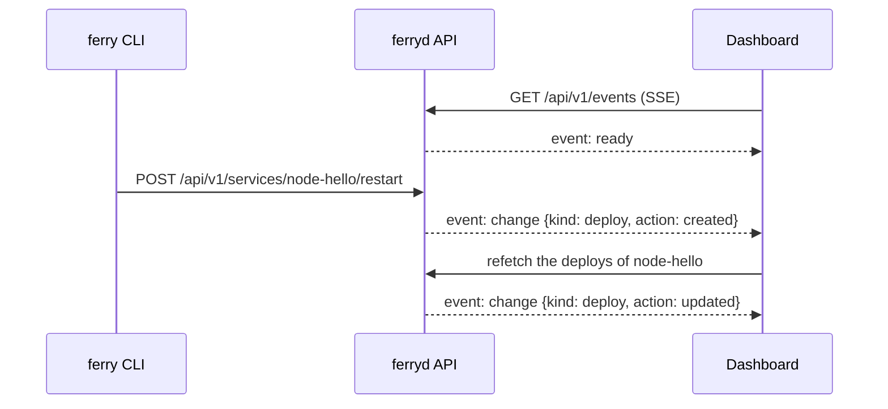

<Diagram
  nodes={[
    { id: 'cli', at: [0, 0], icon: 'terminal', label: 'CLI', note: 'ferry restart' },
    { id: 'api', at: [1.6, 0], icon: 'server', label: 'ferryd', note: 'the API' },
    { id: 'ui', at: [3.2, 0], icon: 'browser', label: 'Dashboard' },
  ]}
  edges={[
    { from: 'cli', to: 'api' },
    { id: 'ask', from: 'ui', to: 'api' },
    { id: 'tell', from: 'api', to: 'ui' },
  ]}
  steps={[
    {
      caption: 'The dashboard opens one connection to ferryd and keeps it open.',
      flow: ['ask'],
      tones: { ui: 'primary' },
    },
    {
      caption: 'A command of the CLI restarts a service.',
      flow: ['cli>api'],
      tones: { cli: 'primary' },
    },
    {
      caption: 'ferryd sends a change event through the open connection.',
      flow: ['tell'],
      tones: { api: 'primary' },
    },
    {
      caption: 'The dashboard gets only the data that changed.',
      flow: ['ask'],
      tones: { ui: 'success' },
      notes: { ui: 'up to date' },
    },
  ]}
/>

The connection uses <Term id="sse" />. Its address is `GET /api/v1/events`.

The server sends a `change` event for each create, update or delete. This applies to a service, a deploy, a datastore, an env group, a job, a git connection and a domain.

## The messages

## If the connection stops

The dashboard connects again. The delay between two tries increases from 1 second to 15 seconds.

During that time, the dashboard asks the server for new data at intervals. Thus the screens stay up to date.

<Accordions>
  <Accordion title="The log pages">
    The log pages use their own streams: one for the deploy logs, one for the job logs and one for the runtime logs. Each new line goes to the end of the list.
  </Accordion>
  <Accordion title="Security of the streams">
    The <Term id="session-cookie" /> authenticates the streams, as it does for each request of the dashboard. No token and no secret goes into a URL.
  </Accordion>
  <Accordion title="More about the events">
    See [Logs & events](/docs/concepts/logs) and the [API reference](/docs/reference/api/events).
  </Accordion>
</Accordions>
