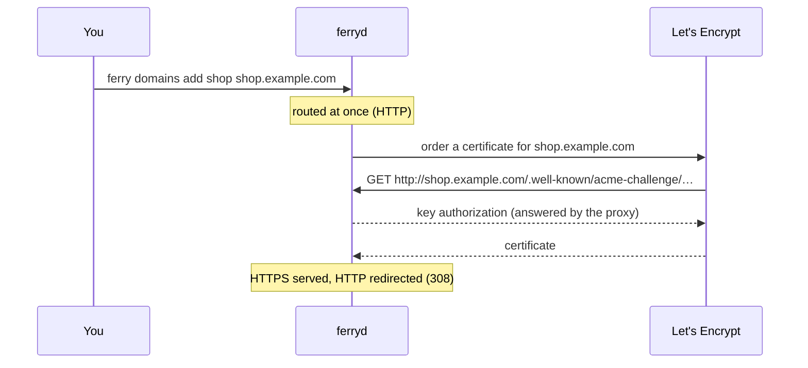

import { Network, ServerCog } from 'lucide-react';

A custom domain is an extra hostname for a web service or a static site. Ferry routes it as soon as you add it, and, when automatic HTTPS is on, gets a certificate for it from Let's Encrypt with the HTTP-01 challenge.



## Before you start

- **HTTPS is enabled on the server:** `ferryd` runs with `--https-addr 0.0.0.0:443` and `--acme-email`. Without them, the domain works over HTTP only. See [Production setup](/docs/guides/production).
- **Port 80 is reachable from the internet** on the server's proxy (`--proxy-addr 0.0.0.0:80`). Let's Encrypt connects there to validate the domain, whatever port the site is served on.
- **The service is a web service or a static site.** Private services, workers and cron jobs can't have domains.

<Steps>
<Step>

### Create the DNS record

At your DNS provider, point the domain at the server:

| Domain | Record |
|---|---|
| A subdomain, like `shop.example.com` | `CNAME` to a name that resolves to the server (for example `shop.apps.example.com`), or `A`/`AAAA` records |
| The apex, like `example.com` | `A` (and `AAAA`) records with the server's IP addresses |

Wait until it resolves:

```bash title="Terminal"
dig +short shop.example.com
```

</Step>
<Step>

### Add the domain to the service

<Tabs items={['CLI', 'API', 'Blueprint']} groupId="interface" persist>
<Tab value="CLI">

```bash title="Terminal"
ferry domains add shop shop.example.com
# Added shop.example.com. Point its DNS (A/AAAA or CNAME) at this server.
ferry domains add shop www.example.com
```

You can also pass `--domain` (repeatable) to `ferry create`, `ferry update` and `ferry up`.

</Tab>
<Tab value="API">

```bash title="Terminal"
curl -X POST http://127.0.0.1:7878/api/v1/services/shop/domains \
  -H "Authorization: Bearer $FERRY_TOKEN" \
  -H 'Content-Type: application/json' \
  -d '{"domain": "shop.example.com"}'
# ["shop.example.com"]
```

See [Custom domains](/docs/reference/api/domains) in the API reference.

</Tab>
<Tab value="Blueprint">

```yaml title="ferry.yaml"
services:
  - type: web
    name: shop
    domains:
      - shop.example.com
      - www.example.com
```

</Tab>
</Tabs>

The domain is routed right away, without a deploy. It is refused if it is invalid, is an IP address, is the default host of a service (`<name>.<base-domain>`), is the dashboard host, or already belongs to another service.

</Step>
<Step>

### Wait for the certificate

Ferry's certificate manager checks for new hostnames every 60 seconds. Watch the server log:

```text title="journalctl -u ferryd"
INFO requesting a TLS certificate for shop.example.com
INFO obtained a TLS certificate for shop.example.com (valid until 2026-12-26 07:12:03 UTC)
```

Then check it:

```bash title="Terminal"
curl -I https://shop.example.com
curl -I http://shop.example.com     # 308 Permanent Redirect to https://shop.example.com/
```

</Step>
</Steps>

## How certificates are managed

- **One certificate per hostname**, stored in `<data-dir>/certs/<host>/` and reloaded when `ferryd` starts.
- **Renewal** starts 30 days before expiry, automatically.
- **Redirects:** once a hostname has a certificate, HTTP requests to it get a `308` redirect to HTTPS. Before that, it is served over HTTP, and over HTTPS with a self-signed certificate.
- **Default hostnames too:** with a public base domain, `<name>.<base-domain>` gets its own certificate like any custom domain.
- **Local names never do:** `localhost`, `*.localhost`, `*.local`, `*.internal`, `*.test` and IP addresses always stay on HTTP.
- **Removing a domain** stops routing it at once: `ferry domains rm shop www.example.com`.

## Troubleshooting

| Symptom | What to check |
|---|---|
| No `requesting a TLS certificate` line | HTTPS isn't on: `ferry info` shows `TLS: disabled` until `ferryd` has both `--https-addr` and `--acme-email`. Local names never get certificates. |
| The request fails in the log, and Ferry retries later | The domain doesn't resolve to this server yet, or port 80 isn't reachable from the internet (firewall, cloud security group, another program on port 80). After a failure, Ferry waits 5 minutes before retrying that hostname, then 10, 20, and so on up to 6 hours. Restarting `ferryd` retries right away. |
| Let's Encrypt rate limits | Test with `--acme-staging` (untrusted certificates, generous limits). When you remove the flag, staging certificates are replaced by production ones. |
| `404` with `x-ferry-error: not_found` | The domain isn't attached to any service on this server: `ferry domains shop`. |
| The app builds `http://` links | Read the scheme from `X-Forwarded-Proto`: the proxy terminates TLS and talks plain HTTP to your app. See [request headers](/docs/concepts/networking#request-headers-your-app-receives). |

<Cards>
  <Card icon={<Network />} title="Networking, domains & TLS" href="/docs/concepts/networking" description="How routing, redirects and certificates work." />
  <Card icon={<ServerCog />} title="Production setup" href="/docs/guides/production" description="Ports 80 and 443, systemd and backups." />
</Cards>
