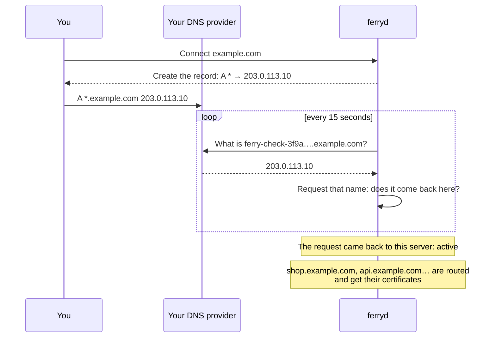

import { Network, ServerCog, ShieldCheck } from 'lucide-react';

A **domain** of the server is a name your services are served under. Connect `example.com` and every web service and static site answers at `<service>.example.com`: `shop.example.com`, `api.example.com`, and so on, without touching the DNS again for each new service.

A server starts with one domain, the `--base-domain` it was started with (`localhost` by default, which only works on the machine itself). You connect others while it runs: no restart, no deploy.



<Callout title="A domain of the server, or a custom domain of a service?">
A domain of the server covers **every** service with one wildcard DNS record: `<service>.example.com`. A [custom domain](/docs/guides/custom-domains-https) is one extra name for **one** service, such as `www.example.com` or the domain itself, with its own DNS record. You can use both.
</Callout>

## Before you start

- **You control the DNS of the domain**, at your registrar or DNS provider. A subdomain works too: `apps.example.com` gives `<service>.apps.example.com`.
- **The server is reachable from the internet on port 80** (`--proxy-addr 0.0.0.0:80`), and on 443 for HTTPS. See [Production setup](/docs/guides/production).
- **For HTTPS**, `ferryd` runs with `--https-addr 0.0.0.0:443` and `--acme-email`. Without them, the domain works over HTTP only.

<Callout type="warning" title="On a public server without --base-domain, turn the dashboard host off">
A server started with the default base domain (`localhost`) also answers its dashboard and API on the public proxy, for the host `ferry.localhost`. That is handy on a laptop; on a server reachable from the internet, start `ferryd` with `--dashboard-host none`, or with a hostname of your own and HTTPS. See [Security model](/docs/architecture/security#exposure).
</Callout>

<Steps>
<Step>

### Connect the domain

<Tabs items={['Dashboard', 'CLI', 'API']} groupId="interface" persist>
<Tab value="Dashboard">

Open **Server → Domains**, click **Connect a domain** and enter the domain: `example.com`. The window then shows the DNS record to create, with a button to copy each value.

</Tab>
<Tab value="CLI">

```bash title="Terminal"
ferry domains connect example.com
# Connected example.com. Services will be served at https://<service>.example.com once its DNS points at this server.
# Create this DNS record where the DNS of example.com is managed:
#
#   TYPE   NAME   VALUE
#   A      *      203.0.113.10
#   A      @      203.0.113.10   optional: only to serve example.com itself
```

</Tab>
<Tab value="API">

```bash title="Terminal"
curl -X POST http://127.0.0.1:7878/api/v1/domains \
  -H "Authorization: Bearer $FERRY_TOKEN" \
  -H 'Content-Type: application/json' \
  -d '{"name": "example.com"}'
# {"id": "dom-…", "name": "example.com", "status": "pending", "served": false,
#  "records": [{"type": "A", "name": "*", "value": "203.0.113.10", "required": true}, …],
#  "url_pattern": "https://<service>.example.com", …}
```

See [Domains](/docs/reference/api/domains) in the API reference.

</Tab>
</Tabs>

The domain starts as **Waiting for DNS** (`pending`): nothing is served under it yet.

</Step>
<Step>

### Create the DNS record

At your DNS provider, add the record Ferry shows:

| Type | Name | Value | |
|---|---|---|---|
| `A` | `*` | the public IP address of the server | required: every service |
| `A` | `@` | the same | optional: only to serve the domain itself |

- **`*` is a wildcard**: one record that answers for every name under the domain. That is why a new service needs no new record.
- **`@` is the domain itself.** You only need it to serve something at `example.com`, as a [custom domain](/docs/guides/custom-domains-https) of one service.
- **Names are relative to the domain.** If you connect `apps.example.com` and your DNS zone is `example.com`, name the records `*.apps` and `apps` there. Ferry shows both forms.
- **IPv6:** when the server knows an IPv6 address of its own (`--public-ip`), Ferry also shows `AAAA` records. They are optional next to the `A` records.

</Step>
<Step>

### Let Ferry verify it

Ferry checks the domain every 15 seconds. You don't have to do anything: once the names under the domain reach the server, it turns **Active**. To check right away, click **Verify now**, or:

```bash title="Terminal"
ferry domains verify example.com
# example.com reaches this server: services are served at https://<service>.example.com
#   dns   passed   *.example.com resolves to 203.0.113.10, this server.
#   http  passed   This server answers on port 80 for names under example.com.
```

`ferry domains verify` exits with code 1 while the domain doesn't reach the server, so a script can wait for it.

From that moment:

- every web service and static site is **served under the domain**, without a deploy;
- with HTTPS on, each hostname gets its **certificate within seconds** (see **Server → Domains → Certificates**, or `ferry certificates`);
- if the default domain was a local name such as `localhost`, the new domain becomes the **default domain**: the one service URLs are shown with.

</Step>
</Steps>

## How Ferry verifies a domain

A verification asks two questions about a name nobody used before, `ferry-check-<random>.example.com`. A new name each time means only a wildcard record can answer for it, and no DNS resolver has an old answer in its cache.

| Check | Question | Passes when |
|---|---|---|
| `dns` | What does the name resolve to? | It resolves to the server's public address. |
| `http` | Who answers a request for it on the public HTTP port? | This very server: the proxy answers a path reserved for the check with a value only this process knows. |

When a check fails, Ferry says what it found:

| Message | What to do |
|---|---|
| No DNS record answers for `*.example.com` yet | Create the record. A new record can take a few minutes to show. |
| It resolves to another address, not to this server | Point the record at the address Ferry shows. |
| It resolves to several addresses, and only one is this server | Remove the other records: visitors sent there don't reach your services. |
| Another server answers | The record points at a machine that isn't this Ferry server, or another program listens on port 80. |
| This server could not reach itself | A warning, not a failure: some networks don't let a machine connect to its own public address. If visitors can't reach your services either, open port 80 in the firewall. |
| It resolves to a private address | The name works from the server and its network, not from the internet. |

Ferry keeps checking after the domain is active, every 10 minutes. If the DNS breaks later, the domain is flagged **Misconfigured** after three failed checks in a row — and **stays served**: a DNS outage must not take your services down with it.

## The default domain

A service is served under every domain of the server, but it is *shown* with one: the default domain. It decides the URL in the dashboard, in `ferry open`, and in the `FERRY_EXTERNAL_URL` variable your app receives.

```bash title="Terminal"
ferry domains default example.com
# example.com is the default domain: services are shown at https://<service>.example.com
```

Running services read their new `FERRY_EXTERNAL_URL` at their next deploy or restart. Only a served domain can be the default.

## Manage domains

```bash title="Terminal"
ferry domains                          # the domains, their status, the record to create
ferry domains verify example.com       # check now
ferry domains default example.com      # the domain service URLs are shown with
ferry domains disconnect example.com   # services stop being served under it
ferry certificates                     # every hostname with the state of its certificate
```

- **Disconnecting** a domain stops serving the services under it at once. Its DNS records stay at your DNS provider. If it was the default domain, the base domain is the default again.
- **The base domain** (set with `--base-domain`) is always served and can't be disconnected: change the flag to change it.
- **Local names** (`*.localhost`, `.test`, `.internal`, `.local`) need no DNS, are never verified and never get a certificate.
- **Limits:** up to 20 connected domains per server. A domain is refused when it would put a service on a hostname that is already taken, such as a custom domain of another service.

## The server's public address

The DNS records point at the address the server is reached at from the internet. Ferry finds its IPv4 address by itself: from its network interface, or, when the server sits behind NAT, by asking a public service which address it sees (`api.ipify.org`, then `ipv4.icanhazip.com`, then `checkip.amazonaws.com`).

To say it yourself, start `ferryd` with `--public-ip`. Ferry then asks nobody:

```bash title="Terminal"
ferryd … --public-ip 203.0.113.10 --public-ip 2001:db8::10
```

This is also the only way to get `AAAA` records: Ferry never guesses an IPv6 address, because the one a machine uses for outgoing connections is often temporary.

## Certificates

With HTTPS on, each hostname gets its own Let's Encrypt certificate. **Server → Domains** lists every routed hostname with the state of its certificate:

| State | Meaning |
|---|---|
| `issued` | Served to browsers, with its expiry date. Renewed 30 days before. |
| `pending`, `issuing` | Being requested: a new hostname gets its certificate within seconds. |
| `failed` | The last request failed. The reason and the time of the next attempt are shown. |
| `local` | A local name: served over HTTP, no certificate. |
| `disabled` | The server runs without HTTPS. |

## What isn't covered yet

- **Wildcard certificates.** Ferry requests one certificate per hostname. A single `*.example.com` certificate needs access to your DNS provider's API.
- **Creating the DNS record for you.** For the same reason, you create the record yourself.
- **The dashboard under a connected domain.** The dashboard's hostname is still set when the server starts, with `--dashboard-host`.
- **Turning HTTPS on from the dashboard.** It is a startup option of `ferryd`.

<Cards cols={3}>
  <Card icon={<ShieldCheck />} title="Custom domains & HTTPS" href="/docs/guides/custom-domains-https" description="One more name for one service." />
  <Card icon={<Network />} title="Networking, domains & TLS" href="/docs/concepts/networking" description="How routing, redirects and certificates work." />
  <Card icon={<ServerCog />} title="Production setup" href="/docs/guides/production" description="Ports 80 and 443, systemd and backups." />
</Cards>
