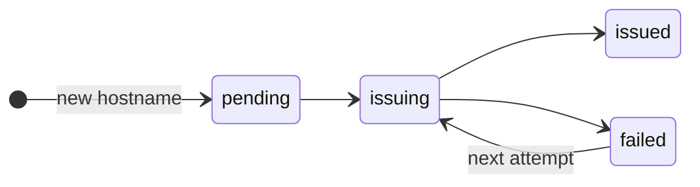

Each <Term id="hostname" /> gets its own <Term id="certificate" /> from <Term id="lets-encrypt" />. A new hostname gets its certificate in seconds.

| State | Meaning |
|---|---|
| `pending`, `issuing` | Ferry asks for the certificate. |
| `issued` | Browsers get the certificate. Ferry shows its expiry date and renews it 30 days before. |
| `failed` | The last request failed. Ferry shows the cause and the time of the next attempt. |
| `local` | A <Term id="local-name" />: Ferry serves it over HTTP, with no certificate. |
| `disabled` | The server runs without <Term id="https" />. |

## See the certificates

```bash title="Terminal"
ferry certificates
```

In the dashboard, **Server → Domains** lists each hostname that the proxy routes, with the state of its certificate.

For a `failed` state, see [Problems](/docs/guides/custom-domains-https/problems). The page [Networking, domains & TLS](/docs/concepts/networking) tells how the routes, the redirects and the certificates work.
