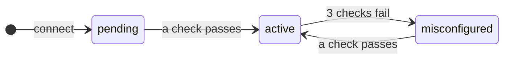

| Status | In the dashboard | Meaning |
|---|---|---|
| `pending` | **Waiting for DNS** | The <Term id="dns" /> does not point to the server. Ferry serves nothing under the domain. |
| `active` | **Active** | The names under the domain reach the server. Ferry serves each service under it. |
| `misconfigured` | **Misconfigured** | The DNS broke after the domain was active. Ferry continues to serve the domain. |

## How frequently Ferry tests

| Status | Test |
|---|---|
| `pending` | Each 15 seconds |
| `active` | Each 10 minutes |

After three failed checks in sequence, an active <Term id="server-domain" /> becomes `misconfigured`. The domain stays online, because a DNS failure must not stop your services.

## See the status

```bash title="Terminal"
ferry domains   # the domains, their status, the record to create
```

In the dashboard, open **Server → Domains**.
