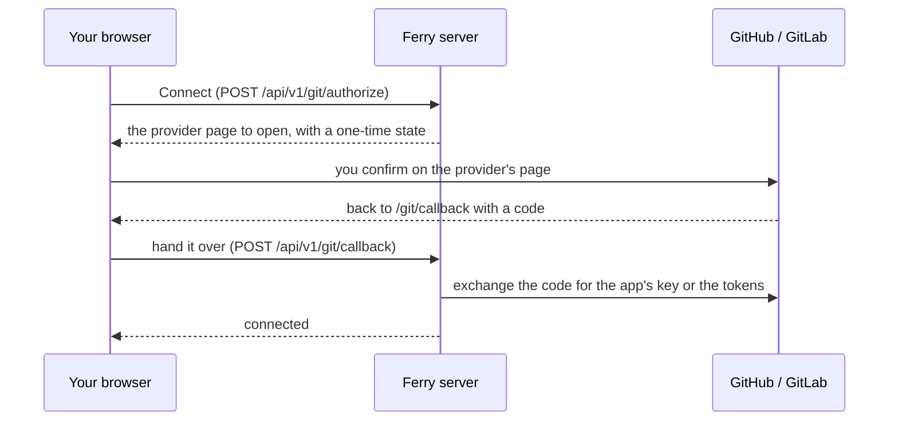

A **git connection** is a GitHub or GitLab account that authorized your Ferry server to read its repositories. It does two things:

- the dashboard lists the account's repositories and their branches, so you pick what to deploy instead of typing it;
- repositories of that account are cloned with it, so **private repositories** deploy without credentials in their URL.

You authorize on the provider's own page: **no token is typed**. It works with github.com, gitlab.com, GitHub Enterprise Server and self-managed GitLab.

<Callout title="The authorization belongs to the server">
An account is connected once, to the server, and every service uses it: nothing is chosen per service. A repository on `github.com/you/…` is cloned with the `you` account as soon as it is connected, whether the service was created in the dashboard, with the CLI, a blueprint or the API.
</Callout>

## Where to connect

As long as the server has no connected account, the dashboard's home page asks for one: **Connect GitHub** or **Connect GitLab**. You can also connect from **+ New service → Git repository → Connected account**, or from **Server → Connections → Git accounts**.

## Connect GitHub

Ferry creates a **GitHub App** for your server: an application of your own, private to your account, that can only read the repositories you choose. Nothing has to be prepared on GitHub.

<Steps>
<Step>

### Continue to GitHub

Click **Connect GitHub**, then **Continue to GitHub**. To deploy the repositories of an organization, open **Organization, self-hosted GitHub** first and enter the organization's login: the app is then created in the organization (you need to be one of its owners).

</Step>
<Step>

### Create the app

GitHub shows the app's name, `ferry-<your server>-<random>`: keep it or change it, and confirm with **Create GitHub App**.

</Step>
<Step>

### Choose the repositories

GitHub then asks where to install the app: **All repositories** or **Only select repositories**. Click **Install**. GitHub sends you back to Ferry, where the account is now connected.

</Step>
</Steps>

To change the repositories later, use **Repositories** next to the account in **Server → Connections**, or **Change them on GitHub** under the repository list of a new service.

## Connect GitLab

GitLab can't create an application on the fly, so you create one for your server, **once**. Every later authorization on that GitLab instance reuses it.

<Steps>
<Step>

### Create the application on GitLab

Click **Connect GitLab**, then **Open GitLab applications** in the dialog (it opens **User settings → Applications** on GitLab) and add an application:

| Field | Value |
|---|---|
| Name | anything, such as `Ferry` |
| Redirect URI | the one the dialog shows, `https://<your dashboard>/git/callback`: copy it from there |
| Confidential | checked |
| Scopes | `read_api` and `read_repository` |

</Step>
<Step>

### Paste its Application ID and Secret

GitLab shows them once the application is saved. Paste both in the dialog and click **Continue to GitLab**. For a self-managed GitLab, open **Self-hosted GitLab** first and enter its address, such as `https://gitlab.example.com`.

</Step>
<Step>

### Authorize the application

GitLab asks whether the application may use your account: click **Authorize**. GitLab sends you back to Ferry, where the account is now connected.

</Step>
</Steps>

## What happens behind the button

If you leave half-way (you close the tab on GitHub, or refuse on GitLab), the connection stays in the list as **Not finished**: **Finish connecting** takes you back where you stopped.

<Callout title="Your server doesn't have to be reachable from the internet">
GitHub and GitLab never call your server during the authorization: they send **your browser** back to the dashboard, which hands the answer to the server. A server on `localhost` or on a private network works, as long as it can reach the provider itself.
</Callout>



The **state** is a random value Ferry makes up for each authorization and accepts once, within an hour: an answer that doesn't carry it is refused. On GitHub the browser makes the round trip twice: once to create the app, once to install it.

## Deploy a repository

With an account connected, the **Connected account** tab of a new service lists its repositories, most recently updated first:

1. choose the account when you connected several, or **Add account**;
2. search by owner or name, and click the repository: private ones have a **Private** badge, and a repository without commits can't be picked;
3. open the **Branch** list: Ferry asks the repository for its branches, the default one first. You can also type a name, for a branch that isn't pushed yet.

Picking a repository fills in its default branch and the service's name, unless you typed one. **Create and deploy** then clones the repository with the account; the deploy log says so:

```text title="Deploy log"
==> Cloning with the GitHub account 'you'
==> Cloning from https://github.com/you/api.git (branch main)
==> Checked out d258434: Initial commit
```

The **Repository URL** tab still takes any git URL: a public repository, an SSH URL, or a path on the server. Its **Branch** list works the same way, and a private repository of a connected account is cloned with that account there too.

<Callout title="Auto-deploy is separate">
A connection lets Ferry read repositories; it doesn't make the provider notify Ferry of pushes. To deploy on every push, set up the [GitHub webhook](/docs/guides/github-auto-deploy) or call the service's deploy hook from your CI.
</Callout>

## Which account clones a repository

Ferry looks at the repository's URL, every time it deploys:

- only an `https://` (or `http://`) URL **on the provider instance of a connected account** is cloned with an account. SSH URLs, paths on the server, other hosts and URLs that carry their own credentials never are;
- when several accounts of that instance are connected, the account that **owns** the repository (`github.com/<account>/…`) is used; otherwise the one connected most recently;
- a GitHub App only reads the account it is installed on. To deploy an organization's repositories, connect the organization as well.

A service's **Settings → Build & deploy** shows the account its repository is cloned with, and has the same **Branch** list.

## Manage the accounts

**Server → Connections → Git accounts** lists the connections, how each one was authorized and the services it clones for.

| Action | What it does |
|---|---|
| **Repositories** (GitHub) | Opens GitHub's page of the app's installation, where you add or remove repositories. |
| **Authorize again** | Repeats the authorization: after it was revoked on GitLab, or when the repository list says the provider no longer accepts it. |
| **Finish connecting** | Resumes an authorization that was left half-way. |
| **Replace token** | For an account connected with an access token: stores a new one. |
| **Disconnect** | Deletes Ferry's copy of the connection. Services whose repository it cloned keep their repository and are cloned without credentials from then on, which fails for private repositories. |

Disconnecting doesn't remove anything on the provider. To revoke the access there: delete the GitHub App (**Settings → Developer settings → GitHub Apps** on GitHub), or revoke the application's authorization (**User settings → Applications** on GitLab).

## Use an access token instead

**Use an access token instead**, at the bottom of the connect dialog, connects the account a personal access token belongs to. It is the way for scripts, and for an instance where you can't create an application.

| Provider | Token | It needs |
|---|---|---|
| GitHub | personal access token (classic) | the `repo` scope |
| GitHub | fine-grained personal access token | read access to **Contents** and **Metadata** of the repositories to deploy |
| GitLab | personal access token | the `read_api` and `read_repository` scopes |

**Create a token on GitHub** (or GitLab) in the dialog opens the provider's token page with a name and the scopes filled in. A token expires: when it does, deploys of private repositories fail until you **Replace token**. An authorization made on the provider's page renews itself.

## What Ferry stores

| Kind | Stored on the server | Used as |
|---|---|---|
| GitHub App | the app's id and private key | the key signs a request for a token that reads the chosen repositories for **one hour**; that token is kept in memory, never stored |
| GitLab application | the application's id and secret, the access token and its refresh token | the access token lasts two hours and is renewed shortly before it expires |
| Access token | the token | as it is |

- All of it lives in the server's database, in the data directory (mode `0700`), like datastore passwords and env values. See [Security model](/docs/architecture/security).
- The API never returns a secret. Of a personal access token it shows `token_hint`, its last characters.
- A token is only sent to its own provider: to its API to list repositories, and to its git server when a repository is cloned or its branches are listed. Never to another host, even when the provider answers with a redirect.
- It never appears on a command line, in the git cache, in a deploy log or in an error message.
- Ferry asks for read access only: `contents: read` and `metadata: read` for the GitHub App, `read_api` and `read_repository` on GitLab.

## With the API

The dashboard uses the [git endpoints of the API](/docs/reference/api/git). A script connects an account with a token, since nobody is there to click on the provider's page:

```bash title="Connect an account with a token"
curl -s -X POST http://127.0.0.1:7878/api/v1/git/connections \
  -H "Authorization: Bearer $FERRY_TOKEN" -H 'Content-Type: application/json' \
  -d '{"provider": "github", "token": "<access token>"}'
```

```json title="Response"
{
  "id": "git-4db07471b4a74da2a889",
  "provider": "github",
  "base_url": "https://github.com",
  "auth": "token",
  "status": "connected",
  "account": "you",
  "account_name": "Your Name",
  "token_hint": "…a1b2",
  "scopes": ["repo"],
  "token_expires_at": "2027-01-01T00:00:00Z",
  "client_id": null,
  "app_slug": null,
  "app_url": null,
  "manage_url": null,
  "repository_selection": null,
  "services": [],
  "created_at": "2026-10-01T09:45:04.121655Z",
  "updated_at": "2026-10-01T09:45:04.121655Z"
}
```

```bash title="List its repositories, the branches of one, then create a service"
curl -s -H "Authorization: Bearer $FERRY_TOKEN" \
  http://127.0.0.1:7878/api/v1/git/connections/git-4db07471b4a74da2a889/repositories

curl -s -G -H "Authorization: Bearer $FERRY_TOKEN" \
  http://127.0.0.1:7878/api/v1/git/branches \
  --data-urlencode 'repo_url=https://github.com/you/api.git'
# {"default_branch":"main","branches":["main","develop"],"connection_id":"git-4db07471b4a74da2a889"}

curl -s -X POST http://127.0.0.1:7878/api/v1/services \
  -H "Authorization: Bearer $FERRY_TOKEN" -H 'Content-Type: application/json' \
  -d '{"name": "api", "repo_url": "https://github.com/you/api.git", "branch": "main"}'
```

The service names no connection: its `repo_url` is on github.com, so it is cloned with the account connected there. The same goes for `ferry create --repo …` and for [blueprints](/docs/reference/blueprint). For a self-hosted provider, add `"base_url": "https://gitlab.example.com"` when you connect.

`GET /api/v1/git/branches` reads the branches from the repository itself (`git ls-remote`), the way a deploy would clone it. It works for any URL a service can deploy from.

To build your own client of the browser flow: `POST /api/v1/git/authorize` with a `redirect_uri` answers with the page to open (`method: post` means: submit a form with `fields`); when the provider sends the browser back to `redirect_uri`, pass its query parameters to `POST /api/v1/git/callback`, and repeat while the answer's `status` is `redirect`.

## Troubleshooting

| What you see | Why, and what to do |
|---|---|
| A repository is missing from the list (GitHub) | The app may only read the repositories you chose: click **Change them on GitHub** and add it. A repository of an organization needs the organization connected. |
| A repository is missing from the list (GitLab, or a token) | The account can't see it: you must be a member of the project; a classic GitHub token needs `repo` and, in some organizations, an SSO authorization. Only the 1000 most recently updated repositories are listed: use the **Repository URL** tab for an older one. |
| `git_application_required` from the API | No application was given for that GitLab instance yet: send its `client_id` and `client_secret` with the request. The dashboard asks for them instead. |
| GitLab says **The redirect URI included is not valid** | The application's Redirect URI isn't the address you opened the dashboard at. Copy it again from the dialog; an application takes several redirect URIs, one per line. |
| **The account was not connected**: GitLab did not authorize Ferry | You clicked **Deny** on GitLab, or the Secret is wrong. Start again with **Finish connecting**; **Use another application** takes a new Application ID and Secret. |
| **This authorization has expired or was already used** | The provider's page stayed open for more than an hour, the callback page was reloaded, or the server restarted meanwhile. Start again. |
| The installation **waits for an owner of the organization to approve it** | You asked to install the app in an organization you don't own. Click **Finish connecting** once an owner approved it. |
| **… no longer accepts this authorization** in the repository list | The app was uninstalled or deleted, the application's authorization was revoked, or the token expired. Use the button next to the message to connect again. |
| A deploy fails with **Authentication failed** or **repository not found**, followed by a `==> Hint` line | The remote refused the clone. The hint says what to do: add the repository to the app's installation, connect the account again, or connect the repository's account when none is. |
| **cannot reach GitLab at https://…** | The server can't reach the provider at that address. An address without a scheme is read as `https://`: for a provider that only speaks http, write `http://…`. |
| The dashboard moved to another address | The provider sends the browser back to the old one. GitLab: add the new redirect URI to the application. GitHub: connect again from the new address (a new app is created), then delete the old app on GitHub. |
