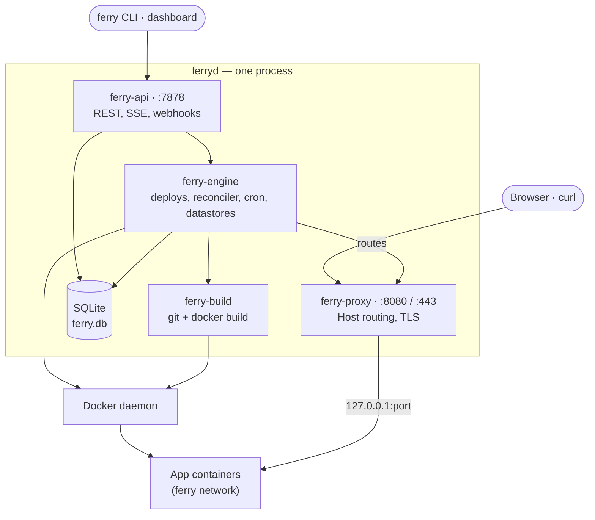

import { BookOpen, Boxes, Braces, Download, Rocket, Server, Terminal, Wrench } from 'lucide-react';

Ferry turns one machine with Docker into your own Render. You point it at a git repository, a local folder or a Docker image, and it builds the code, deploys it with zero downtime and gives it a URL. It also scales, heals and logs your apps, and runs managed Postgres and Redis, cron jobs, env groups, custom domains with automatic HTTPS, and `render.yaml` blueprints.

Docker is the only runtime dependency. The server, `ferryd`, is a single process; you drive it from the web dashboard, the `ferry` CLI or the REST API.

```bash title="Deploy the current directory"
ferry up
```

<Cards>
  <Card icon={<Rocket />} title="Quickstart" href="/docs/getting-started/quickstart" description="Start a server and deploy your first app." />
  <Card icon={<Download />} title="Installation" href="/docs/getting-started/installation" description="Build ferryd, the ferry CLI and the dashboard from source." />
</Cards>

## How Ferry compares to Render

Ferry covers the building blocks of Render on a single server you run yourself.

| Render feature | In Ferry |
|---|---|
| Web services, private services, background workers, cron jobs, static sites | Yes, all five service types |
| Deploy from Git, auto-deploy on push | Yes: GitHub webhook (`/hooks/github`), any git URL including a path on the server |
| Deploy a prebuilt Docker image | Yes (`--image`) |
| Native runtimes (Node, Python, Go, Rust, Ruby, static) and Dockerfiles | Yes: runtime detection and generated Dockerfiles |
| Zero-downtime deploys, health checks | Yes: blue/green per deploy, health check path (`--health`) |
| Rollbacks, deploy history, build logs | Yes |
| Manual deploys, deploy hooks | Yes: a secret URL, `/hooks/deploy/{id}?key=…` |
| Environment variables, environment groups | Yes (secret files are not supported) |
| Private network (`service-name:port`) | Yes: a Docker bridge network with DNS aliases |
| Managed Postgres, Key Value (Redis) | Yes: containers with volumes, internal and external URLs |
| Persistent disks | Yes: a named volume; a service with a disk runs 1 instance and its deploys stop the old instance first |
| Custom domains, free TLS | Yes: Let's Encrypt (ACME HTTP-01) |
| Manual scaling | Yes: instances behind round-robin load balancing in the proxy |
| Instance types (`plan`) | Yes: [memory and CPU limits](/docs/concepts/resource-limits) per service and datastore (server defaults 512 MiB and 1 CPU per container); a blueprint's `plan` becomes limits |
| Suspend, resume, restart | Yes |
| One-off jobs | Yes (`ferry run`) |
| Blueprints (`render.yaml`) | Yes: `ferry blueprint apply`, same schema (a subset) |
| Logs (build and runtime, live tail), basic metrics | Yes: Server-Sent Events streams, CPU and memory per instance against its limits, out-of-memory kills flagged |
| Dashboard, CLI, REST API | Yes |
| — | Ferry extra: `ferry up` deploys a local directory without git |

<Callout type="warning" title="Not in Ferry v1">
Multiple nodes, autoscaling, pull request previews, private registry authentication, secret files, IP allow lists, and teams or role-based access control.
</Callout>

## Architecture

Everything runs in one `ferryd` process. The public proxy routes requests by `Host` header to app containers on the same machine; the API serves the dashboard, the CLI and webhooks; the engine builds images, starts containers and keeps them converged with the desired state stored in SQLite.



A deploy clones the repository (or unpacks an upload), detects the runtime and builds an image, starts new containers next to the old ones, health-checks them, switches the proxy to them in one step, then drains and stops the old ones. A reconciler loop replaces crashed containers, enforces instance counts and refreshes routes. Read more in [Architecture](/docs/architecture/overview).

## Where to go next

<Cards>
  <Card icon={<BookOpen />} title="Getting started" href="/docs/getting-started/installation" description="Install Ferry, deploy an app, tour the dashboard and set up the CLI." />
  <Card icon={<Boxes />} title="Concepts" href="/docs/concepts/services" description="Services, deploys, builds, networking, environment, datastores and more." />
  <Card icon={<Wrench />} title="Guides" href="/docs/guides/github-auto-deploy" description="Auto-deploy from GitHub, run Postgres, migrate from Render, go to production." />
  <Card icon={<Terminal />} title="CLI reference" href="/docs/reference/cli" description="Every ferry command and option." />
  <Card icon={<Server />} title="Server options" href="/docs/reference/server-options" description="Every ferryd flag and environment variable." />
  <Card icon={<Braces />} title="API reference" href="/docs/reference/api" description="Every endpoint of the REST API, from the OpenAPI document." />
</Cards>
